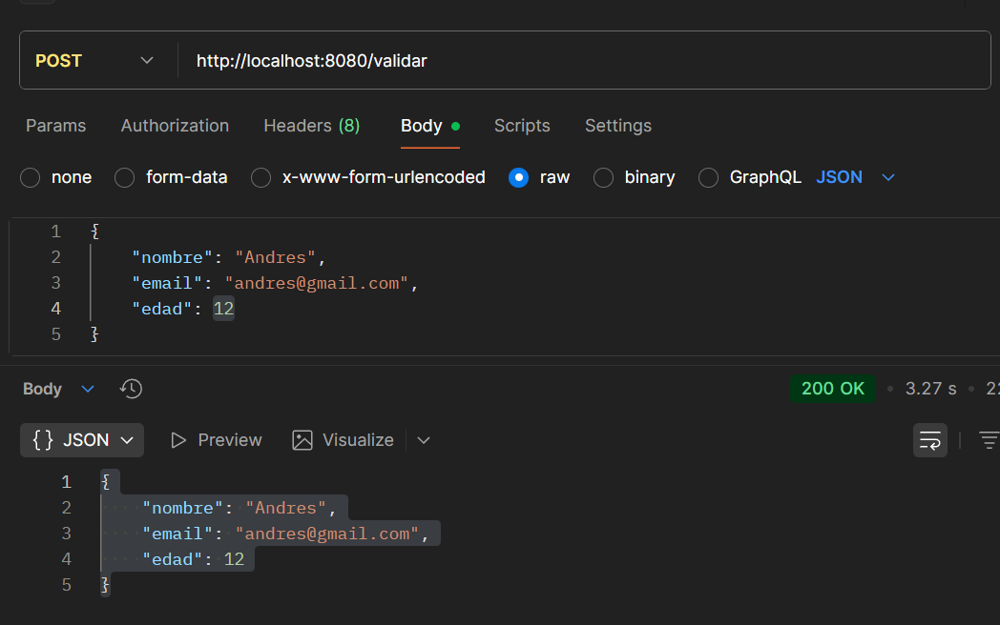

# Proyecto Maven con Spring Boot - Validación de Formularios

## Descripción del Proyecto
Proyecto de demostración del ciclo de vida de Maven y validación de formularios usando Spring Boot, desarrollado con IntelliJ IDEA.

**Tecnologías utilizadas:**
- Java 21.0.6
- Spring Boot 3.5.7
- Maven 3.x
- Lombok 1.18.30
- Jakarta Validation API 3.1.1
- IntelliJ IDEA

---

## Índice
1. [Paso 1: Creación del proyecto base con Maven](#paso-1-creación-del-proyecto-base-con-maven-en-intellij-idea)
2. [Paso 2: Simulación del flujo de desarrollo con Maven](#paso-2-simulación-del-flujo-de-desarrollo-con-maven)
3. [Paso 3: Integración de un formulario con validación básica](#paso-3-integración-de-un-formulario-con-validación-básica)
4. [Paso 4: Manejo de dependencias, repositorios y estructura](#paso-4-manejo-de-dependencias-repositorios-y-estructura)
5. [Paso 5: Documentación y presentación](#paso-5-documentación-y-presentación)

---

## Paso 1: Creación del proyecto base con Maven en IntelliJ IDEA

### Elección: Spring Boot vs Spring MVC

**✅ Seleccionamos: Spring Boot**

#### Justificación de la elección:

| Criterio | Spring MVC | Spring Boot | Ganador |
|----------|-----------|-------------|---------|
| **Configuración** | Requiere XML extenso o JavaConfig manual | Autoconfiguración inteligente | ✅ Boot |
| **Servidor** | Necesita servidor externo (Tomcat, etc.) | Servidor embebido incluido | ✅ Boot |
| **Dependencias** | Gestión manual de cada dependencia | Starters agrupan dependencias | ✅ Boot |
| **Tiempo de setup** | 2-4 horas para proyecto básico | 5-10 minutos | ✅ Boot |
| **Curva de aprendizaje** | Alta - requiere conocer configuración | Baja - convention over configuration | ✅ Boot |
| **Productividad** | Media | Alta | ✅ Boot |

**Razones detalladas:**

1. **Configuración automática**:
    - Spring Boot configura automáticamente componentes basándose en las dependencias del classpath
    - No necesita archivos XML complejos ni múltiples clases de configuración
    - Ejemplo: Al agregar `spring-boot-starter-web`, automáticamente configura Spring MVC, Jackson, Tomcat

2. **Servidor embebido**:
    - Incluye Tomcat embebido, no requiere instalación ni configuración externa
    - JAR ejecutable con `java -jar` - portabilidad máxima
    - Ideal para microservicios y despliegue en contenedores

3. **Gestión simplificada de dependencias**:
    - Los "starters" agrupan dependencias comunes
    - `spring-boot-starter-web` incluye todas las dependencias necesarias para web
    - Gestión automática de versiones compatibles

4. **Desarrollo más rápido**:
    - Menos configuración = más tiempo para lógica de negocio
    - Hot reload con DevTools
    - Actuator para métricas y monitoreo out-of-the-box

5. **Ideal para aprendizaje**:
    - Permite enfocarse en conceptos de negocio
    - Menos "magia negra" de configuración
    - Documentación extensa y comunidad activa


---

### Configuración del pom.xml

```xml
<?xml version="1.0" encoding="UTF-8"?>
<project xmlns="http://maven.apache.org/POM/4.0.0" 
         xmlns:xsi="http://www.w3.org/2001/XMLSchema-instance"
         xsi:schemaLocation="http://maven.apache.org/POM/4.0.0 
         https://maven.apache.org/xsd/maven-4.0.0.xsd">
    <modelVersion>4.0.0</modelVersion>
    
    <!-- Parent POM: Hereda configuración de Spring Boot -->
    <parent>
        <groupId>org.springframework.boot</groupId>
        <artifactId>spring-boot-starter-parent</artifactId>
        <version>3.5.7</version>
        <relativePath/>
    </parent>
    
    <!-- Datos básicos del proyecto (Coordenadas Maven) -->
    <groupId>com</groupId>
    <artifactId>demo</artifactId>
    <version>0.0.1-SNAPSHOT</version>
    <name>demo</name>
    <description>Proyecto de validación con Spring Boot y Maven</description>
    
    <!-- Propiedades del proyecto -->
    <properties>
        <java.version>17</java.version>
    </properties>
    
    <!-- Dependencias del proyecto -->
    <dependencies>
        <!-- 1. Spring Boot Starter Thymeleaf -->
        <dependency>
            <groupId>org.springframework.boot</groupId>
            <artifactId>spring-boot-starter-thymeleaf</artifactId>
        </dependency>
        
        <!-- 2. Spring Boot Starter Web -->
        <dependency>
            <groupId>org.springframework.boot</groupId>
            <artifactId>spring-boot-starter-web</artifactId>
        </dependency>
        
        <!-- 3. Lombok -->
        <dependency>
            <groupId>org.projectlombok</groupId>
            <artifactId>lombok</artifactId>
            <optional>true</optional>
        </dependency>
        
        <!-- 4. Spring Boot Starter Test -->
        <dependency>
            <groupId>org.springframework.boot</groupId>
            <artifactId>spring-boot-starter-test</artifactId>
            <scope>test</scope>
        </dependency>
        
        <!-- 5. Jakarta Validation API -->
        <dependency>
            <groupId>jakarta.validation</groupId>
            <artifactId>jakarta.validation-api</artifactId>
            <version>3.1.1</version>
        </dependency>
        
        <!-- 6. Hibernate Validator (Implementación de Jakarta Validation) -->
        <dependency>
            <groupId>org.springframework.boot</groupId>
            <artifactId>spring-boot-starter-validation</artifactId>
        </dependency>
    </dependencies>
    
    <!-- Configuración de construcción -->
    <build>
        <plugins>
            <!-- Plugin para compilar con soporte de Lombok -->
            <plugin>
                <groupId>org.apache.maven.plugins</groupId>
                <artifactId>maven-compiler-plugin</artifactId>
                <configuration>
                    <annotationProcessorPaths>
                        <path>
                            <groupId>org.projectlombok</groupId>
                            <artifactId>lombok</artifactId>
                        </path>
                    </annotationProcessorPaths>
                </configuration>
            </plugin>
            
            <!-- Plugin de Spring Boot para empaquetar JAR ejecutable -->
            <plugin>
                <groupId>org.springframework.boot</groupId>
                <artifactId>spring-boot-maven-plugin</artifactId>
                <configuration>
                    <excludes>
                        <exclude>
                            <groupId>org.projectlombok</groupId>
                            <artifactId>lombok</artifactId>
                        </exclude>
                    </excludes>
                </configuration>
            </plugin>
        </plugins>
    </build>
</project>
```

#### Explicación de elementos clave del POM:

**1. Datos básicos (GAV Coordinates):**
```xml
<groupId>com</groupId>           <!-- Identificador de organización -->
<artifactId>demo</artifactId>    <!-- Nombre del proyecto -->
<version>0.0.1-SNAPSHOT</version><!-- Versión (SNAPSHOT = desarrollo) -->
```

**2. Parent POM:**
- Hereda configuración de Spring Boot Parent
- Gestiona versiones de todas las dependencias de Spring
- Proporciona configuración de plugins optimizada

**3. Properties:**
```xml
<java.version>17</java.version>  <!-- Versión de Java a usar -->
```

---

### Dependencias incluidas (detalle completo):

#### 1. **spring-boot-starter-thymeleaf**
```xml
<dependency>
    <groupId>org.springframework.boot</groupId>
    <artifactId>spring-boot-starter-thymeleaf</artifactId>
</dependency>
```
**Propósito:** Motor de plantillas para vistas HTML dinámicas
**Incluye:**
- Thymeleaf Template Engine
- Spring integration para Thymeleaf
- Soporte para fragmentos y layouts

**Uso en el proyecto:** Aunque no lo usamos en este proyecto (usamos HTML estático), está disponible para crear vistas dinámicas server-side.

---

#### 2. **spring-boot-starter-web**
```xml
<dependency>
    <groupId>org.springframework.boot</groupId>
    <artifactId>spring-boot-starter-web</artifactId>
</dependency>
```
**Propósito:** Framework completo para desarrollo web
**Incluye:**
- Spring MVC (framework web)
- Apache Tomcat embebido (servidor)
- Jackson (serialización JSON)
- Validation (Bean Validation)
- Spring Web (utilidades web)

**Dependencias transitivas principales:**
```
spring-boot-starter-web
├── spring-boot-starter (base)
├── spring-boot-starter-json (Jackson)
├── spring-boot-starter-tomcat (servidor)
├── spring-web (HTTP, REST)
└── spring-webmvc (MVC framework)
```

---

#### 3. **lombok**
```xml
<dependency>
    <groupId>org.projectlombok</groupId>
    <artifactId>lombok</artifactId>
    <optional>true</optional>
</dependency>
```
**Propósito:** Reduce código boilerplate mediante anotaciones
**Características:**
- `@Data`: Genera getters, setters, toString, equals, hashCode
- `@AllArgsConstructor`: Constructor con todos los parámetros
- `@NoArgsConstructor`: Constructor sin parámetros
- `@Builder`: Patrón Builder
- `@Slf4j`: Logger automático

**Nota:** `<optional>true</optional>` indica que Lombok solo se necesita en compile-time, no en runtime.

---

#### 4. **spring-boot-starter-test**
```xml
<dependency>
    <groupId>org.springframework.boot</groupId>
    <artifactId>spring-boot-starter-test</artifactId>
    <scope>test</scope>
</dependency>
```
**Propósito:** Framework completo para testing
**Incluye:**
- JUnit 5 (Jupiter)
- Mockito (mocking)
- AssertJ (assertions fluidas)
- Hamcrest (matchers)
- Spring Test (integración)

**Nota:** `<scope>test</scope>` = solo disponible en pruebas, no se empaqueta en el JAR final.

---

#### 5. **jakarta.validation-api**
```xml
<dependency>
    <groupId>jakarta.validation</groupId>
    <artifactId>jakarta.validation-api</artifactId>
    <version>3.1.1</version>
</dependency>
```
**Propósito:** API estándar para validación de beans
**Define anotaciones:**
- `@NotNull`, `@NotBlank`, `@NotEmpty`
- `@Size`, `@Min`, `@Max`
- `@Email`, `@Pattern`
- `@Past`, `@Future`

**Nota:** Es solo la API (interfaz), necesita una implementación.

---

#### 6. **spring-boot-starter-validation**
```xml
<dependency>
    <groupId>org.springframework.boot</groupId>
    <artifactId>spring-boot-starter-validation</artifactId>
</dependency>
```
**Propósito:** Implementación completa de Jakarta Bean Validation
**Incluye:**
- Hibernate Validator (implementación de referencia)
- Jakarta Validation API
- Expression Language para mensajes
- Integración con Spring MVC

**Función:** Procesa las anotaciones de validación y ejecuta las validaciones.

---

### Plugins configurados:

#### 1. **maven-compiler-plugin**
```xml
<plugin>
    <groupId>org.apache.maven.plugins</groupId>
    <artifactId>maven-compiler-plugin</artifactId>
    <configuration>
        <annotationProcessorPaths>
            <path>
                <groupId>org.projectlombok</groupId>
                <artifactId>lombok</artifactId>
            </path>
        </annotationProcessorPaths>
    </configuration>
</plugin>
```
**Función:** Configura el compilador Java para procesar anotaciones de Lombok en tiempo de compilación.

---

#### 2. **spring-boot-maven-plugin**
```xml
<plugin>
    <groupId>org.springframework.boot</groupId>
    <artifactId>spring-boot-maven-plugin</artifactId>
    <configuration>
        <excludes>
            <exclude>
                <groupId>org.projectlombok</groupId>
                <artifactId>lombok</artifactId>
            </exclude>
        </excludes>
    </configuration>
</plugin>
```
**Función:**
- Crea JAR ejecutable con todas las dependencias
- Excluye Lombok del JAR final (no se necesita en runtime)
- Permite ejecutar con `mvn spring-boot:run`


---

## Paso 2: Simulación del flujo de desarrollo con Maven

### Ciclo de vida de Maven

Maven define **3 ciclos de vida independientes**:

1. **clean**: Limpieza del proyecto
2. **default**: Construcción y despliegue (el más usado)
3. **site**: Generación de documentación

El ciclo **default** tiene las siguientes fases principales (en orden):

```
validate → compile → test → package → verify → install → deploy
```

**Regla importante:** Al ejecutar una fase, Maven ejecuta automáticamente todas las fases anteriores.

---

### 1. mvn clean

```bash
mvn clean
```

**Output real del proyecto:**
```
[INFO] Scanning for projects...
[INFO] 
[INFO] ------------------------------< com:demo >------------------------------
[INFO] Building demo 0.0.1-SNAPSHOT
[INFO]   from pom.xml
[INFO] --------------------------------[ jar ]---------------------------------
[INFO] 
[INFO] --- clean:3.4.1:clean (default-clean) @ demo ---
[INFO] Deleting C:\Users\andre\Desktop\New folder (3)\demo\target
[INFO] ------------------------------------------------------------------------
[INFO] BUILD SUCCESS
[INFO] ------------------------------------------------------------------------
[INFO] Total time:  0.560 s
[INFO] Finished at: 2025-10-23T21:56:17-03:00
[INFO] ------------------------------------------------------------------------
```

#### Análisis del comando:

**¿Qué hace?**
- Elimina completamente el directorio `target/`
- Borra todos los archivos compilados (.class)
- Borra archivos empaquetados (.jar)
- Borra reportes de tests
- Deja el proyecto en estado limpio

**¿Cuándo usarlo?**
- Antes de un build desde cero
- Cuando hay problemas de compilación extraños
- Para liberar espacio en disco
- Antes de hacer commit al repositorio

**Ciclo de vida:** Pre-build (limpieza)

**Tiempo de ejecución:** 0.560 segundos

**Plugin usado:** `maven-clean-plugin:3.4.1`


---

### 2. mvn compile

```bash
mvn compile
```

**Output real del proyecto:**
```
[INFO] Scanning for projects...
[INFO] 
[INFO] ------------------------------< com:demo >------------------------------
[INFO] Building demo 0.0.1-SNAPSHOT
[INFO]   from pom.xml
[INFO] --------------------------------[ jar ]---------------------------------
[INFO] 
[INFO] --- resources:3.3.1:resources (default-resources) @ demo ---
[INFO] Copying 1 resource from src\main\resources to target\classes
[INFO] Copying 2 resources from src\main\resources to target\classes
[INFO] 
[INFO] --- compiler:3.14.1:compile (default-compile) @ demo ---
Downloading from central: https://repo.maven.apache.org/maven2/org/ow2/asm/asm/9.8/asm-9.8.jar
Downloaded from central: https://repo.maven.apache.org/maven2/org/ow2/asm/asm/9.8/asm-9.8.jar (126 kB at 220 kB/s)
Downloading from central: https://repo.maven.apache.org/maven2/org/codehaus/plexus/plexus-java/1.5.0/plexus-java-1.5.0.jar
Downloading from central: https://repo.maven.apache.org/maven2/org/codehaus/plexus/plexus-xml/3.0.1/plexus-xml-3.0.1.jar
Downloading from central: https://repo.maven.apache.org/maven2/org/codehaus/plexus/plexus-utils/4.0.2/plexus-utils-4.0.2.jar
Downloaded from central: https://repo.maven.apache.org/maven2/org/codehaus/plexus/plexus-xml/3.0.1/plexus-xml-3.0.1.jar (94 kB at 1.6 MB/s)
Downloaded from central: https://repo.maven.apache.org/maven2/org/codehaus/plexus/plexus-java/1.5.0/plexus-java-1.5.0.jar (57 kB at 322 kB/s)
Downloaded from central: https://repo.maven.apache.org/maven2/org/codehaus/plexus/plexus-utils/4.0.2/plexus-utils-4.0.2.jar (193 kB at 518 kB/s)
[INFO] Recompiling the module because of changed source code.
[INFO] Compiling 5 source files with javac [debug parameters release 17] to target\classes
[INFO] ------------------------------------------------------------------------
[INFO] BUILD SUCCESS
[INFO] ------------------------------------------------------------------------
[INFO] Total time:  3.592 s
[INFO] Finished at: 2025-10-23T21:56:44-03:00
[INFO] ------------------------------------------------------------------------
```

#### Análisis del comando:

**Fases ejecutadas (en orden):**
1. **validate**: Valida que el proyecto sea correcto
2. **resources**: Copia recursos de `src/main/resources` a `target/classes`
3. **compile**: Compila código fuente Java

**¿Qué hace?**
- Copia recursos estáticos (HTML, properties, etc.)
- Compila código Java de `src/main/java`
- **Lombok procesa anotaciones** y genera código
- Genera archivos `.class` en `target/classes`
- **NO** compila el código de pruebas

**Archivos generados:**
```
target/
  └── classes/
      ├── com/
      │   └── example/
      │       └── demo/
      │           └── DemoApplication.class
      ├── DTOs/
      │   ├── RequestDatos.class
      │   └── UserDatos.class
      ├── controllers/
      │   └── ValidationController.class
      ├── application.properties
      └── static/
          └── index.html
```

**Estadísticas:**
- Archivos Java compilados: 5
- Recursos copiados: 3
- Tiempo: 3.592 segundos
- Plugins descargados: 3 (primera vez)

**Ciclo de vida:** Default (compile phase)

**Plugins usados:**
- `maven-resources-plugin:3.3.1`
- `maven-compiler-plugin:3.14.1`

**Descarga de dependencias:**
En la primera ejecución, Maven descarga plugins necesarios:
- `asm-9.8.jar` (126 KB) - Manipulación de bytecode
- `plexus-java-1.5.0.jar` (57 KB) - Utilidades Java
- `plexus-xml-3.0.1.jar` (94 KB) - Parsing XML
- `plexus-utils-4.0.2.jar` (193 KB) - Utilidades generales


---

### 3. mvn test

```bash
mvn test
```

**Output real del proyecto (extracto clave):**
```
[INFO] --- surefire:3.5.4:test (default-test) @ demo ---
Downloading from central: https://repo.maven.apache.org/maven2/org/apache/maven/surefire/surefire-api/3.5.4/surefire-api-3.5.4.jar
Downloaded from central: https://repo.maven.apache.org/maven2/org/apache/maven/surefire/surefire-api/3.5.4/surefire-api-3.5.4.jar (174 kB at 241 kB/s)
[INFO] Using auto detected provider org.apache.maven.surefire.junitplatform.JUnitPlatformProvider
[INFO]
[INFO] -------------------------------------------------------
[INFO]  T E S T S
[INFO] -------------------------------------------------------
[INFO] Running com.example.demo.DemoApplicationTests

  .   ____          _            __ _ _
 /\\ / ___'_ __ _ _(_)_ __  __ _ \ \ \ \
( ( )\___ | '_ | '_| | '_ \/ _` | \ \ \ \
 \\/  ___)| |_)| | | | | || (_| |  ) ) ) )
  '  |____| .__|_| |_|_| |_\__, | / / / /
 =========|_|==============|___/=/_/_/_/

 :: Spring Boot ::                (v3.5.7)

2025-10-23T21:57:06.569-03:00  INFO 17396 --- [demo] [           main] com.example.demo.DemoApplicationTests    : Starting DemoApplicationTests using Java 21.0.6 with PID 17396
2025-10-23T21:57:06.570-03:00  INFO 17396 --- [demo] [           main] com.example.demo.DemoApplicationTests    : No active profile set, falling back to 1 default profile: "default"
2025-10-23T21:57:07.908-03:00  INFO 17396 --- [demo] [           main] com.example.demo.DemoApplicationTests    : Started DemoApplicationTests in 1.662 seconds

[INFO] Tests run: 1, Failures: 0, Errors: 0, Skipped: 0, Time elapsed: 2.813 s -- in com.example.demo.DemoApplicationTests
[INFO] 
[INFO] Results:
[INFO]
[INFO] Tests run: 1, Failures: 0, Errors: 0, Skipped: 0
[INFO]
[INFO] ------------------------------------------------------------------------
[INFO] BUILD SUCCESS
[INFO] ------------------------------------------------------------------------
[INFO] Total time:  8.836 s
[INFO] Finished at: 2025-10-23T21:57:08-03:00
[INFO] ------------------------------------------------------------------------
```

#### Análisis del comando:

**Fases ejecutadas:**
1. validate → compile → **test-compile** → **test**

**¿Qué hace?**
- Compila código principal (si no está compilado)
- Compila código de pruebas de `src/test/java`
- Ejecuta todas las pruebas unitarias
- Genera reportes en `target/surefire-reports`
- **NO** crea el archivo JAR

**Pruebas ejecutadas:**
```
com.example.demo.DemoApplicationTests
├── contextLoads() ✅
```

**Resultados:**
- Tests ejecutados: 1
- Exitosos: 1 ✅
- Fallos: 0
- Errores: 0
- Omitidos: 0
- Tiempo de ejecución: 2.813 segundos

**Contexto de Spring Boot:**
- Inicia contexto de Spring completo
- Carga configuración de aplicación
- Detecta `@SpringBootConfiguration` automáticamente
- Tiempo de inicio: 1.662 segundos

**Plugin usado:** `maven-surefire-plugin:3.5.4`

**Provider detectado:** JUnit Platform (JUnit 5)

**Reportes generados:**
```
target/
  └── surefire-reports/
      ├── com.example.demo.DemoApplicationTests.txt
      └── TEST-com.example.demo.DemoApplicationTests.xml
```

**Warnings observados:**
```
2025-10-23T21:57:07.564-03:00  INFO 17396 --- [demo] [           main] o.s.v.b.OptionalValidatorFactoryBean     : Failed to set up a Bean Validation provider
```
**Nota:** Este warning no afecta las pruebas, pero indica que falta configurar correctamente Hibernate Validator.


---

### 4. mvn package

```bash
mvn package
```

**Output real del proyecto (extracto clave):**
```
[INFO] --- surefire:3.5.4:test (default-test) @ demo ---
[INFO] Tests run: 1, Failures: 0, Errors: 0, Skipped: 0, Time elapsed: 2.341 s
[INFO]
[INFO] --- jar:3.4.2:jar (default-jar) @ demo ---
[INFO] Building jar: C:\Users\andre\Desktop\New folder (3)\demo\target\demo-0.0.1-SNAPSHOT.jar
[INFO] 
[INFO] --- spring-boot:3.5.7:repackage (repackage) @ demo ---
Downloading from central: https://repo.maven.apache.org/maven2/org/springframework/boot/spring-boot-buildpack-platform/3.5.7/spring-boot-buildpack-platform-3.5.7.jar
Downloaded from central: https://repo.maven.apache.org/maven2/org/springframework/boot/spring-boot-buildpack-platform/3.5.7/spring-boot-buildpack-platform-3.5.7.jar (319 kB at 811 kB/s)
[INFO] Replacing main artifact C:\Users\andre\Desktop\New folder (3)\demo\target\demo-0.0.1-SNAPSHOT.jar with repackaged archive, adding nested dependencies in BOOT-INF/.
[INFO] The original artifact has been renamed to C:\Users\andre\Desktop\New folder (3)\demo\target\demo-0.0.1-SNAPSHOT.jar.original
[INFO] ------------------------------------------------------------------------
[INFO] BUILD SUCCESS
[INFO] ------------------------------------------------------------------------
[INFO] Total time:  6.226 s
[INFO] Finished at: 2025-10-23T21:57:38-03:00
[INFO] ------------------------------------------------------------------------
```

#### Análisis del comando:

**Fases ejecutadas:**
1. validate → compile → test → **package**

**¿Qué hace?**
- Ejecuta todas las fases anteriores (compile + test)
- Crea JAR inicial con las clases compiladas
- **Spring Boot repackage**: Transforma el JAR en ejecutable
- Añade todas las dependencias dentro del JAR (fat JAR)
- Guarda JAR original como `.jar.original`

**Archivos generados:**
```
target/
  ├── demo-0.0.1-SNAPSHOT.jar          (JAR ejecutable ~30 MB)
  └── demo-0.0.1-SNAPSHOT.jar.original (JAR original ~10 KB)
```

**Estructura del JAR ejecutable:**
```
demo-0.0.1-SNAPSHOT.jar
├── BOOT-INF/
│   ├── classes/                  (nuestras clases)
│   │   ├── com/
│   │   ├── DTOs/
│   │   ├── controllers/
│   │   └── application.properties
│   └── lib/                      (dependencias)
│       ├── spring-boot-3.5.7.jar
│       ├── spring-web-6.2.6.jar
│       ├── tomcat-embed-core-10.1.48.jar
│       └── ... (todas las dependencias)
├── META-INF/
│   ├── MANIFEST.MF
│   └── maven/
└── org/
    └── springframework/
        └── boot/
            └── loader/           (Spring Boot Loader)
```

**Plugins usados:**
- `maven-jar-plugin:3.4.2` - Crea JAR básico
- `spring-boot-maven-plugin:3.5.7` - Reempaqueta como ejecutable

**Dependencias descargadas (primera vez):**
- spring-boot-buildpack-platform (319 KB)
- jna-platform (1.4 MB)
- commons-compress (1.1 MB)
- httpclient5 (959 KB)
- Y más...

**Tiempo total:** 6.226 segundos

**Ciclo de vida:** Default (package phase)

**Ejecutar el JAR:**
```bash
java -jar target/demo-0.0.1-SNAPSHOT.jar
```


---

### 5. mvn install

```bash
mvn install
```

**Output real del proyecto (extracto clave):**
```
[INFO] --- surefire:3.5.4:test (default-test) @ demo ---
[INFO] Tests run: 1, Failures: 0, Errors: 0, Skipped: 0, Time elapsed: 2.350 s
[INFO]
[INFO] --- jar:3.4.2:jar (default-jar) @ demo ---
[INFO] 
[INFO] --- spring-boot:3.5.7:repackage (repackage) @ demo ---
[INFO] Replacing main artifact with repackaged archive
[INFO]
[INFO] --- install:3.1.4:install (default-install) @ demo ---
Downloading from central: https://repo.maven.apache.org/maven2/org/apache/maven/resolver/maven-resolver-util/1.9.22/maven-resolver-util-1.9.22.jar
Downloaded from central: https://repo.maven.apache.org/maven2/org/apache/maven/resolver/maven-resolver-util/1.9.22/maven-resolver-util-1.9.22.jar (196 kB at 555 kB/s)
[INFO] Installing C:\Users\andre\Desktop\New folder (3)\demo\pom.xml to C:\Users\andre\.m2\repository\com\demo\0.0.1-SNAPSHOT\demo-0.0.1-SNAPSHOT.pom
[INFO] Installing C:\Users\andre\Desktop\New folder (3)\demo\target\demo-0.0.1-SNAPSHOT.jar to C:\Users\andre\.m2\repository\com\demo\0.0.1-SNAPSHOT\demo-0.0.1-SNAPSHOT.jar
[INFO] ------------------------------------------------------------------------
[INFO] BUILD SUCCESS
[INFO] ------------------------------------------------------------------------
[INFO] Total time:  5.981 s
[INFO] Finished at: 2025-10-23T21:58:12-03:00
[INFO] ------------------------------------------------------------------------
```

#### Análisis del comando:

**Fases ejecutadas:**
1. validate → compile → test → package → **install**

**¿Qué hace?**
- Ejecuta todas las fases anteriores (incluyendo package)
- **Instala el JAR en el repositorio local de Maven**
- Instala también el POM del proyecto
- Permite que otros proyectos locales usen este artefacto

**Archivos instalados:**
```
C:\Users\andre\.m2\repository\
  └── com/
      └── demo/
          └── 0.0.1-SNAPSHOT/
              ├── demo-0.0.1-SNAPSHOT.jar      (JAR ejecutable)
              ├── demo-0.0.1-SNAPSHOT.pom      (POM del proyecto)
              ├── maven-metadata-local.xml     (Metadata)
              └── _remote.repositories         (Info de origen)
```

**¿Para qué sirve?**
- Otros proyectos Maven en tu máquina pueden usar este artefacto como dependencia
- Útil en proyectos multi-módulo
- Cache local para desarrollo

**Ejemplo de uso en otro proyecto:**
```xml
<dependency>
    <groupId>com</groupId>
    <artifactId>demo</artifactId>
    <version>0.0.1-SNAPSHOT</version>
</dependency>
```

**Plugin usado:** `maven-install-plugin:3.1.4`

**Tiempo total:** 5.981 segundos

**Ciclo de vida:** Default (install phase)


---

### Resumen del Ciclo de Vida de Maven

| Comando | Fases ejecutadas | Tiempo | Resultado principal | Cuándo usarlo |
|---------|------------------|--------|---------------------|---------------|
| `mvn clean` | clean | 0.560s | Elimina target/ | Antes de build limpio |
| `mvn compile` | validate, compile | 3.592s | Genera .class | Verificar compilación |
| `mvn test` | compile, test-compile, test | 8.836s | Ejecuta tests | Verificar tests |
| `mvn package` | compile, test, package | 6.226s | Genera JAR ejecutable | Crear distributable |
| `mvn install` | package, install | 5.981s | JAR en repo local | Multi-módulo/desarrollo |

**Diagrama del ciclo de vida:**

```
┌─────────────┐
│   CLEAN     │  mvn clean
└──────┬──────┘
       │
┌──────▼──────┐
│  VALIDATE   │  Valida proyecto
└──────┬──────┘
       │
┌──────▼──────┐
│  COMPILE    │  mvn compile → Compila código
└──────┬──────┘
       │
┌──────▼──────┐
│    TEST     │  mvn test → Ejecuta tests
└──────┬──────┘
       │
┌──────▼──────┐
│  PACKAGE    │  mvn package → Crea JAR
└──────┬──────┘
       │
┌──────▼──────┐
│  INSTALL    │  mvn install → Instala localmente
└──────┬──────┘
       │
┌──────▼──────┐
│   DEPLOY    │  mvn deploy → Sube a repo remoto
└─────────────┘
```


---

## Paso 3: Integración de un formulario con validación básica

### Estructura del Proyecto

Según la imagen proporcionada, el proyecto tiene la siguiente estructura:

```
demo/
├── src/
│   ├── main/
│   │   ├── java/
│   │   │   ├── com.example.demo/
│   │   │   │   └── DemoApplication.java      (Clase principal)
│   │   │   ├── controller/
│   │   │   │   └── ValidationController.java (Controlador REST)
│   │   │   └── DTOs/
│   │   │       ├── RequestDatos.java         (DTO entrada)
│   │   │       └── UserDatos.java            (DTO salida)
│   │   └── resources/
│   │       ├── application.properties
│   │       └── static/
│   │           └── index.html                (Formulario)
│   └── test/
│       └── java/
│           └── com.example.demo/
│               └── DemoApplicationTests.java
├── target/                                    (Generado por Maven)
├── .gitattributes
├── .gitignore
├── HELP.md
├── mvnw
├── mvnw.cmd
├── pom.xml
└── README.md
```


---

### Código de las Clases DTO

#### UserDatos.java
**Ubicación:** `src/main/java/DTOs/UserDatos.java`

```java
package DTOs;

import lombok.AllArgsConstructor;
import lombok.Data;
import lombok.NoArgsConstructor;

/**
 * DTO (Data Transfer Object) para responder con datos validados
 * Usa Lombok para generar automáticamente:
 * - Getters y setters para todos los campos
 * - Constructor con todos los parámetros
 * - Constructor sin parámetros
 * - toString(), equals(), hashCode()
 */
@Data                      // Genera getters, setters, toString, equals, hashCode
@AllArgsConstructor        // Constructor con todos los parámetros
@NoArgsConstructor         // Constructor sin parámetros (requerido por Spring)
public class UserDatos {
    private String nombre;
    private String email;
    private Integer edad;
}
```

**Equivalente sin Lombok (45+ líneas):**
```java
public class UserDatos {
    private String nombre;
    private String email;
    private Integer edad;
    
    public UserDatos() {}
    
    public UserDatos(String nombre, String email, Integer edad) {
        this.nombre = nombre;
        this.email = email;
        this.edad = edad;
    }
    
    // Getters
    public String getNombre() { return nombre; }
    public String getEmail() { return email; }
    public Integer getEdad() { return edad; }
    
    // Setters
    public void setNombre(String nombre) { this.nombre = nombre; }
    public void setEmail(String email) { this.email = email; }
    public void setEdad(Integer edad) { this.edad = edad; }
    
    // toString, equals, hashCode...
}
```

**Con Lombok:** Solo 10 líneas ✅

---

#### RequestDatos.java
**Ubicación:** `src/main/java/DTOs/RequestDatos.java`

```java
package DTOs;

import jakarta.validation.constraints.*;
import lombok.AllArgsConstructor;
import lombok.Data;
import lombok.NoArgsConstructor;

/**
 * DTO para recibir y validar datos del cliente
 * Usa Jakarta Bean Validation para validaciones declarativas
 */
@Data
@AllArgsConstructor
@NoArgsConstructor
public class RequestDatos {
    
    /**
     * Validación del nombre:
     * - @NotBlank: No puede ser null, vacío o solo espacios
     * - @Size: Debe tener entre 3 y 50 caracteres
     */
    @NotBlank(message = "El nombre es obligatorio")
    @Size(min = 3, max = 50, message = "El nombre debe tener entre 3 y 50 caracteres")
    private String nombre;
    
    /**
     * Validación del email:
     * - @NotBlank: No puede estar vacío
     * - @Email: Debe tener formato válido de email
     */
    @NotBlank(message = "El email es obligatorio")
    @Email(message = "El email debe ser válido")
    private String email;
    
    /**
     * Validación de la edad:
     * - @NotNull: No puede ser null
     * - @Min: Debe ser mayor o igual a 18
     * - @Max: Debe ser menor o igual a 120
     */
    @NotNull(message = "La edad es obligatoria")
    @Min(value = 18, message = "Debes ser mayor de 18 años")
    @Max(value = 120, message = "La edad debe ser menor a 120 años")
    private Integer edad;
}
```

**Anotaciones de Jakarta Validation explicadas:**

| Anotación | Tipo | Validación | Ejemplo |
|-----------|------|------------|---------|
| `@NotNull` | Cualquiera | No puede ser null | `@NotNull Integer edad` |
| `@NotBlank` | String | No null, no vacío, no solo espacios | `@NotBlank String nombre` |
| `@NotEmpty` | String, Collection | No null, no vacío | `@NotEmpty List<String>` |
| `@Size` | String, Collection | Longitud/tamaño | `@Size(min=3, max=50)` |
| `@Min` | Number | Valor mínimo | `@Min(18)` |
| `@Max` | Number | Valor máximo | `@Max(120)` |
| `@Email` | String | Formato de email | `@Email` |
| `@Pattern` | String | Expresión regular | `@Pattern(regexp="...")` |
| `@Past` | Date, LocalDate | Fecha pasada | `@Past LocalDate` |
| `@Future` | Date, LocalDate | Fecha futura | `@Future LocalDate` |


---

### Código del Controlador

**ValidationController.java**
**Ubicación:** `src/main/java/controllers/ValidationController.java`

```java
package controllers;

import DTOs.RequestDatos;
import DTOs.UserDatos;
import jakarta.validation.Valid;
import org.springframework.http.ResponseEntity;
import org.springframework.validation.BindingResult;
import org.springframework.validation.FieldError;
import org.springframework.web.bind.annotation.*;

import java.util.HashMap;
import java.util.Map;

/**
 * Controlador REST para validación de datos de usuarios
 * 
 * @RestController: Indica que esta clase es un controlador REST
 * @CrossOrigin: Permite peticiones desde cualquier origen (CORS)
 * @RequestMapping: Prefijo base para todos los endpoints
 */
@RestController
@CrossOrigin(origins = "*")  // En producción, especificar origins concretos
@RequestMapping("/api")
public class ValidationController {

    /**
     * Endpoint de prueba para verificar que el servidor funciona
     * GET /api/test
     */
    @GetMapping("/test")
    public String test() {
        return "¡El servidor funciona correctamente!";
    }

    /**
     * Endpoint principal de validación
     * POST /api/validar
     * 
     * @param datos RequestDatos con anotaciones de validación
     * @param result BindingResult que captura errores de validación
     * @return ResponseEntity con UserDatos (200 OK) o errores (400 Bad Request)
     */
    @PostMapping("/validar")
    public ResponseEntity<?> validarDatos(
            @Valid @RequestBody RequestDatos datos,  // @Valid activa validaciones
            BindingResult result) {                   // Captura errores
        
        // Si hay errores de validación, construir mapa de errores
        if (result.hasErrors()) {
            Map<String, String> errores = new HashMap<>();
            
            // Iterar sobre cada error de campo
            for (FieldError error : result.getFieldErrors()) {
                errores.put(error.getField(), error.getDefaultMessage());
            }
            
            // Retornar 400 Bad Request con mapa de errores
            return ResponseEntity.badRequest().body(errores);
        }
        
        // Si la validación es exitosa, crear objeto de respuesta
        UserDatos userDatos = new UserDatos(
            datos.getNombre(),
            datos.getEmail(),
            datos.getEdad()
        );
        
        // Retornar 200 OK con datos validados
        return ResponseEntity.ok(userDatos);
    }
}
```

**Componentes clave del controlador:**

1. **@RestController**:
    - Combina `@Controller` + `@ResponseBody`
    - Serializa automáticamente objetos a JSON

2. **@CrossOrigin(origins = "*")**:
    - Permite peticiones desde cualquier origen
    - Soluciona problemas de CORS
    - **En producción:** especificar origins concretos

3. **@Valid**:
    - Activa las validaciones de Jakarta Bean Validation
    - Valida el objeto RequestDatos antes de entrar al método

4. **BindingResult**:
    - Contiene los errores de validación si los hay
    - Debe ir inmediatamente después del parámetro @Valid

5. **ResponseEntity<?**:
    - Permite controlar el código de estado HTTP
    - `ResponseEntity.ok(datos)` → 200 OK
    - `ResponseEntity.badRequest()` → 400 Bad Request

**Flujo de validación:**

```
1. Cliente envía POST /api/validar con JSON
        ↓
2. Spring deserializa JSON → RequestDatos
        ↓
3. @Valid activa validaciones Jakarta
        ↓
4. ¿Hay errores?
   ├─ SÍ → BindingResult.hasErrors() = true
   │         → Construir mapa de errores
   │         → return 400 Bad Request
   │
   └─ NO → Crear UserDatos
           → return 200 OK
```


---

### Formulario HTML

**index.html**
**Ubicación:** `src/main/resources/static/index.html`

```html
<!DOCTYPE html>
<html lang="es">
<head>
    <meta charset="UTF-8">
    <meta name="viewport" content="width=device-width, initial-scale=1.0">
    <title>Formulario de Validación - Spring Boot</title>
    <style>
        * {
            margin: 0;
            padding: 0;
            box-sizing: border-box;
        }
        
        body {
            font-family: 'Segoe UI', Tahoma, Geneva, Verdana, sans-serif;
            background: linear-gradient(135deg, #667eea 0%, #764ba2 100%);
            min-height: 100vh;
            display: flex;
            justify-content: center;
            align-items: center;
            padding: 20px;
        }
        
        .container {
            background-color: white;
            padding: 40px;
            border-radius: 10px;
            box-shadow: 0 10px 25px rgba(0,0,0,0.2);
            max-width: 500px;
            width: 100%;
        }
        
        h2 {
            text-align: center;
            color: #333;
            margin-bottom: 30px;
            font-size: 28px;
        }
        
        .form-group {
            margin-bottom: 20px;
        }
        
        label {
            display: block;
            margin-bottom: 8px;
            font-weight: 600;
            color: #555;
            font-size: 14px;
        }
        
        input {
            width: 100%;
            padding: 12px 15px;
            border: 2px solid #e0e0e0;
            border-radius: 6px;
            font-size: 14px;
            transition: border-color 0.3s;
        }
        
        input:focus {
            outline: none;
            border-color: #667eea;
        }
        
        input.error-input {
            border-color: #e74c3c;
        }
        
        button {
            background: linear-gradient(135deg, #667eea 0%, #764ba2 100%);
            color: white;
            padding: 14px 20px;
            border: none;
            border-radius: 6px;
            cursor: pointer;
            width: 100%;
            font-size: 16px;
            font-weight: 600;
            margin-top: 10px;
            transition: transform 0.2s, box-shadow 0.2s;
        }
        
        button:hover {
            transform: translateY(-2px);
            box-shadow: 0 5px 15px rgba(102, 126, 234, 0.4);
        }
        
        button:active {
            transform: translateY(0);
        }
        
        .error {
            color: #e74c3c;
            font-size: 12px;
            margin-top: 5px;
            display: none;
            font-weight: 500;
        }
        
        .error.show {
            display: block;
        }
        
        .success {
            background-color: #d4edda;
            color: #155724;
            padding: 20px;
            border: 1px solid #c3e6cb;
            border-radius: 6px;
            margin-top: 20px;
            display: none;
        }
        
        .success.show {
            display: block;
            animation: slideIn 0.3s ease-out;
        }
        
        .success strong {
            display: block;
            margin-bottom: 10px;
            font-size: 16px;
        }
        
        .success-detail {
            margin: 5px 0;
            font-size: 14px;
        }
        
        @keyframes slideIn {
            from {
                opacity: 0;
                transform: translateY(-10px);
            }
            to {
                opacity: 1;
                transform: translateY(0);
            }
        }
        
        .loading {
            pointer-events: none;
            opacity: 0.6;
        }
    </style>
</head>
<body>
    <div class="container">
        <h2>📋 Formulario de Validación</h2>
        
        <form id="validationForm">
            <div class="form-group">
                <label for="nombre">Nombre Completo:</label>
                <input type="text" id="nombre" name="nombre" placeholder="Ej: Juan Pérez">
                <div class="error" id="errorNombre"></div>
            </div>

            <div class="form-group">
                <label for="email">Correo Electrónico:</label>
                <input type="email" id="email" name="email" placeholder="ejemplo@correo.com">
                <div class="error" id="errorEmail"></div>
            </div>

            <div class="form-group">
                <label for="edad">Edad:</label>
                <input type="number" id="edad" name="edad" placeholder="18">
                <div class="error" id="errorEdad"></div>
            </div>

            <button type="submit">✓ Validar Datos</button>
        </form>

        <div class="success" id="successMessage">
            <strong>✓ ¡Datos validados correctamente!</strong>
            <div class="success-detail" id="successDetails"></div>
        </div>
    </div>

    <script>
        // Referencias a elementos del DOM
        const form = document.getElementById('validationForm');
        const nombreInput = document.getElementById('nombre');
        const emailInput = document.getElementById('email');
        const edadInput = document.getElementById('edad');
        const errorNombre = document.getElementById('errorNombre');
        const errorEmail = document.getElementById('errorEmail');
        const errorEdad = document.getElementById('errorEdad');
        const successMessage = document.getElementById('successMessage');
        const successDetails = document.getElementById('successDetails');

        /**
         * Limpia todos los mensajes de error y estilos
         */
        function clearErrors() {
            errorNombre.classList.remove('show');
            errorEmail.classList.remove('show');
            errorEdad.classList.remove('show');
            successMessage.classList.remove('show');
            
            nombreInput.classList.remove('error-input');
            emailInput.classList.remove('error-input');
            edadInput.classList.remove('error-input');
        }

        /**
         * Muestra un error específico en un campo
         */
        function showError(element, errorElement, message) {
            errorElement.textContent = message;
            errorElement.classList.add('show');
            element.classList.add('error-input');
        }

        /**
         * Maneja el envío del formulario
         */
        form.addEventListener('submit', async function(e) {
            e.preventDefault();  // Prevenir envío tradicional
            clearErrors();
            
            // Construir objeto de datos
            const datos = {
                nombre: nombreInput.value,
                email: emailInput.value,
                edad: parseInt(edadInput.value) || null
            };
            
            // Indicador visual de carga
            form.classList.add('loading');
            
            try {
                // Enviar petición POST al backend
                const response = await fetch('http://localhost:8080/api/validar', {
                    method: 'POST',
                    headers: {
                        'Content-Type': 'application/json',
                    },
                    body: JSON.stringify(datos)
                });
                
                const data = await response.json();
                
                if (response.ok) {
                    // Validación exitosa (200 OK)
                    successDetails.innerHTML = `
                        <div class="success-detail"><strong>Nombre:</strong> ${data.nombre}</div>
                        <div class="success-detail"><strong>Email:</strong> ${data.email}</div>
                        <div class="success-detail"><strong>Edad:</strong> ${data.edad} años</div>
                    `;
                    successMessage.classList.add('show');
                    form.reset();
                } else {
                    // Errores de validación (400 Bad Request)
                    if (data.nombre) showError(nombreInput, errorNombre, data.nombre);
                    if (data.email) showError(emailInput, errorEmail, data.email);
                    if (data.edad) showError(edadInput, errorEdad, data.edad);
                }
            } catch (error) {
                // Error de conexión
                showError(nombreInput, errorNombre, 
                    'Error de conexión. Verifique que el servidor esté corriendo en http://localhost:8080');
            } finally {
                form.classList.remove('loading');
            }
        });
    </script>
</body>
</html>
```

**Características del formulario:**

1. **Diseño responsive**: Se adapta a diferentes tamaños de pantalla
2. **Validación en tiempo real**: Feedback inmediato visual
3. **Fetch API**: Comunicación asíncrona con el backend
4. **Manejo de errores**: Muestra errores específicos por campo
5. **UX mejorada**: Animaciones, estados de carga, colores intuitivos

**Flujo de interacción:**

```
Usuario llena formulario
        ↓
Click "Validar Datos"
        ↓
JavaScript previene envío tradicional
        ↓
Construye objeto JSON
        ↓
Envía POST a /api/validar
        ↓
¿Respuesta 200 OK?
├─ SÍ → Muestra mensaje de éxito verde
│        → Resetea formulario
│
└─ NO (400) → Muestra errores en cada campo
              → Resalta campos con error en rojo
```


---

### Validaciones implementadas

#### Tabla completa de validaciones:

| Campo | Validación | Regla | Mensaje de error |
|-------|-----------|-------|------------------|
| **Nombre** | @NotBlank | No puede estar vacío | "El nombre es obligatorio" |
| | @Size(min=3, max=50) | 3-50 caracteres | "El nombre debe tener entre 3 y 50 caracteres" |
| **Email** | @NotBlank | No puede estar vacío | "El email es obligatorio" |
| | @Email | Formato válido | "El email debe ser válido" |
| **Edad** | @NotNull | No puede ser null | "La edad es obligatoria" |
| | @Min(18) | Mínimo 18 | "Debes ser mayor de 18 años" |
| | @Max(120) | Máximo 120 | "La edad debe ser menor a 120 años" |

#### Niveles de validación:

**1. Validación HTML5 (Cliente - Básica):**
```html
<input type="text" required minlength="3" maxlength="50">
<input type="email" required>
<input type="number" min="18" max="120" required>
```

**2. Validación JavaScript (Cliente - Intermedia):**
- Verificación antes de enviar
- Feedback visual inmediato
- Prevención de envíos inválidos

**3. Validación Jakarta (Servidor - **CRÍTICA**):**
- Validación declarativa con anotaciones
- **Nunca se debe confiar solo en validaciones de cliente**
- Protección real contra ataques

#### Arquitectura de validación:

```
┌─────────────────────────────────────────────────────┐
│               CLIENTE (Navegador)                    │
│                                                      │
│  HTML5 Validation  →  JavaScript Validation         │
│  (Básica, UX)         (Intermedia, UX)             │
└───────────────────┬─────────────────────────────────┘
                    │ fetch POST
                    │ { "nombre": "...", ... }
                    ▼
┌─────────────────────────────────────────────────────┐
│              SERVIDOR (Spring Boot)                  │
│                                                      │
│  @Valid @RequestBody RequestDatos datos             │
│           ↓                                          │
│  Jakarta Bean Validation                             │
│  - @NotBlank, @Email, @Min, @Max                    │
│           ↓                                          │
│  BindingResult result                                │
│           ↓                                          │
│  ¿result.hasErrors()?                               │
│  ├─ SÍ → 400 Bad Request + errores                  │
│  └─ NO → 200 OK + UserDatos                         │
└─────────────────────────────────────────────────────┘
```

#### Casos de prueba:

| # | Nombre | Email | Edad | Esperado | Mensaje |
|---|--------|-------|------|----------|---------|
| 1 | "Juan Pérez" | "juan@mail.com" | 25 | ✅ 200 OK | Datos válidos |
| 2 | "AB" | "test@mail.com" | 30 | ❌ 400 | Nombre muy corto |
| 3 | "Carlos" | "invalido" | 25 | ❌ 400 | Email sin @ |
| 4 | "María" | "maria@mail.com" | 15 | ❌ 400 | Menor de 18 |
| 5 | "" | "test@mail.com" | 25 | ❌ 400 | Nombre vacío |
| 6 | "Pedro López" | "pedro@mail.com" | 150 | ❌ 400 | Edad > 120 |
| 7 | "Ana García" | "ana@correo.com" | null | ❌ 400 | Edad null |
| 8 | "Luis Martínez con nombre muy largo que excede cincuenta caracteres" | "luis@mail.com" | 30 | ❌ 400 | Nombre > 50 |


---

## Paso 4: Manejo de dependencias, repositorios y estructura

### ¿Cómo se descargaron las dependencias?

Maven sigue un proceso específico para gestionar dependencias:

#### Proceso detallado:

```
1. LECTURA DEL POM
   Maven lee pom.xml y identifica todas las dependencias
   Incluye dependencias transitivas (dependencias de dependencias)
   
2. BÚSQUEDA EN REPOSITORIO LOCAL
   Ubicación: C:\Users\andre\.m2\repository
   Maven busca primero en cache local
   
3. SI NO EXISTE LOCALMENTE
   ↓
   Descarga desde Maven Central Repository
   URL: https://repo.maven.apache.org/maven2/
   ↓
   Descarga dependencias transitivas recursivamente
   ↓
   Verifica checksums (SHA-1, MD5) para integridad
   
4. ALMACENAMIENTO
   Guarda JAR en repositorio local
   Guarda POM de la dependencia
   Guarda metadata (_remote.repositories)
   
5. CLASSPATH
   Agrega todas las dependencias al classpath del proyecto
```

#### Ejemplo real del proyecto (spring-boot-starter-web):

```
Solicitado: spring-boot-starter-web:3.5.7
    ↓
Busca en: C:\Users\andre\.m2\repository\org\springframework\boot\spring-boot-starter-web\3.5.7\
    ↓
NO ENCONTRADO → Descarga desde Maven Central
    ↓
Descarga: spring-boot-starter-web-3.5.7.jar (5 KB)
Descarga: spring-boot-starter-web-3.5.7.pom
    ↓
Lee POM → Descubre dependencias transitivas:
    ├─ spring-boot-starter:3.5.7
    ├─ spring-boot-starter-json:3.5.7
    ├─ spring-boot-starter-tomcat:3.5.7
    ├─ spring-web:6.2.6
    └─ spring-webmvc:6.2.6
    ↓
Repite proceso para cada dependencia transitiva
    ↓
TOTAL DESCARGADO: ~150 MB (primera vez)
    ↓
Guarda en repositorio local
```

#### Evidencia en logs del proyecto:

```
[INFO] --- compiler:3.14.1:compile (default-compile) @ demo ---
Downloading from central: https://repo.maven.apache.org/maven2/org/ow2/asm/asm/9.8/asm-9.8.jar
Downloaded from central: https://repo.maven.apache.org/maven2/org/ow2/asm/asm/9.8/asm-9.8.jar (126 kB at 220 kB/s)
Downloading from central: https://repo.maven.apache.org/maven2/org/codehaus/plexus/plexus-java/1.5.0/plexus-java-1.5.0.jar
```


---

### Repositorio local de Maven

#### Ubicación del repositorio:

**Windows:**
```
C:\Users\andre\.m2\repository\
```

**Linux/Mac:**
```
~/.m2/repository/
```

#### Estructura del repositorio local (proyecto real):

```
C:\Users\andre\.m2\repository\
├── org/
│   ├── springframework/
│   │   └── boot/
│   │       ├── spring-boot-starter-web/
│   │       │   └── 3.5.7/
│   │       │       ├── spring-boot-starter-web-3.5.7.jar
│   │       │       ├── spring-boot-starter-web-3.5.7.pom
│   │       │       ├── spring-boot-starter-web-3.5.7.jar.sha1
│   │       │       └── _remote.repositories
│   │       ├── spring-boot-starter-validation/
│   │       ├── spring-boot-starter-thymeleaf/
│   │       └── spring-boot/
│   ├── projectlombok/
│   │   └── lombok/
│   │       └── 1.18.30/
│   │           ├── lombok-1.18.30.jar
│   │           ├── lombok-1.18.30.pom
│   │           └── _remote.repositories
│   ├── apache/
│   │   ├── maven/
│   │   └── httpcomponents/
│   └── ow2/
│       └── asm/
│           └── asm/9.8/
│               ├── asm-9.8.jar
│               └── asm-9.8.pom
├── jakarta/
│   └── validation/
│       └── jakarta.validation-api/
│           └── 3.1.1/
│               ├── jakarta.validation-api-3.1.1.jar
│               ├── jakarta.validation-api-3.1.1.pom
│               └── _remote.repositories
├── net/
│   ├── bytebuddy/
│   │   └── byte-buddy-agent/1.17.8/
│   └── java/
│       └── dev/
│           └── jna/
└── com/
    └── demo/
        └── 0.0.1-SNAPSHOT/
            ├── demo-0.0.1-SNAPSHOT.jar       (Nuestro proyecto)
            ├── demo-0.0.1-SNAPSHOT.pom
            └── maven-metadata-local.xml
```

#### Tipos de archivos en el repositorio:

| Extensión | Descripción | Tamaño típico | Ejemplo |
|-----------|-------------|---------------|---------|
| `.jar` | Biblioteca compilada (bytecode Java) | 50 KB - 50 MB | lombok-1.18.30.jar |
| `.pom` | Project Object Model (metadatos) | 1-50 KB | lombok-1.18.30.pom |
| `.xml` | Archivos de configuración | 1-10 KB | maven-metadata-local.xml |
| `.sha1` | Checksum SHA-1 para verificar integridad | 40 bytes | asm-9.8.jar.sha1 |
| `.md5` | Checksum MD5 | 32 bytes | asm-9.8.jar.md5 |
| `_remote.repositories` | Info del repositorio remoto | < 1 KB | _remote.repositories |

#### Contenido de archivos de metadata:

**_remote.repositories:**
```properties
#NOTE: This is a Maven Resolver internal implementation file
spring-boot-starter-web-3.5.7.jar>central=
spring-boot-starter-web-3.5.7.pom>central=
```

**maven-metadata-local.xml:**
```xml
<?xml version="1.0" encoding="UTF-8"?>
<metadata modelVersion="1.1.0">
  <groupId>com</groupId>
  <artifactId>demo</artifactId>
  <version>0.0.1-SNAPSHOT</version>
  <versioning>
    <snapshot>
      <localCopy>true</localCopy>
    </snapshot>
    <lastUpdated>20251023215812</lastUpdated>
    <snapshotVersions>
      <snapshotVersion>
        <extension>jar</extension>
        <value>0.0.1-SNAPSHOT</value>
        <updated>20251023215812</updated>
      </snapshotVersion>
    </snapshotVersions>
  </versioning>
</metadata>
```

#### Tamaño del repositorio local (proyecto actual):

```
Total del repositorio: ~500 MB - 2 GB (depende de proyectos)
Solo este proyecto: ~150 MB (dependencias de Spring Boot)
```

#### Comandos útiles para el repositorio:

```bash
# Ver tamaño del repositorio
du -sh ~/.m2/repository

# Limpiar repositorio completo (CUIDADO)
rm -rf ~/.m2/repository

# Limpiar solo snapshots
mvn dependency:purge-local-repository -DsnapshotsOnly=true

# Ver árbol de dependencias
mvn dependency:tree

# Analizar dependencias no usadas
mvn dependency:analyze
```


---

### Estructura del proyecto Maven

#### Estructura completa del proyecto (según imagen):

```
demo/
├── .idea/                          # Configuración de IntelliJ IDEA
│   ├── compiler.xml
│   ├── jarRepositories.xml
│   ├── misc.xml
│   ├── modules.xml
│   └── workspace.xml
│
├── src/
│   ├── main/
│   │   ├── java/
│   │   │   ├── com.example.demo/
│   │   │   │   └── DemoApplication.java
│   │   │   ├── controller/
│   │   │   │   └── ValidationController.java
│   │   │   └── DTOs/
│   │   │       ├── RequestDatos.java
│   │   │       └── UserDatos.java
│   │   └── resources/
│   │       ├── application.properties
│   │       ├── static/
│   │       │   ├── index.html
│   │       │   ├── postman-test.png
│   │       │   └── (otras imágenes)
│   │       └── templates/          # Para Thymeleaf (vacío en este proyecto)
│   │
│   └── test/
│       ├── java/
│       │   └── com.example.demo/
│       │       └── DemoApplicationTests.java
│       └── resources/              # Recursos para pruebas (vacío)
│
├── target/                         # GENERADO POR MAVEN (no versionar)
│   ├── classes/
│   │   ├── com/
│   │   ├── DTOs/
│   │   ├── controllers/
│   │   ├── application.properties
│   │   └── static/
│   ├── generated-sources/
│   │   └── annotations/            # Código generado por Lombok
│   ├── test-classes/
│   ├── surefire-reports/           # Reportes de pruebas
│   │   ├── com.example.demo.DemoApplicationTests.txt
│   │   └── TEST-com.example.demo.DemoApplicationTests.xml
│   ├── demo-0.0.1-SNAPSHOT.jar     # JAR ejecutable
│   └── demo-0.0.1-SNAPSHOT.jar.original
│
├── .gitattributes
├── .gitignore
├── HELP.md
├── mvnw                            # Maven Wrapper (Unix)
├── mvnw.cmd                        # Maven Wrapper (Windows)
├── pom.xml                         # Configuración de Maven
└── README.md                       # Documentación del proyecto
```

#### Explicación detallada de carpetas:

**1. `.idea/`** (Específico de IntelliJ IDEA)
```
.idea/
├── compiler.xml       # Configuración del compilador
├── jarRepositories.xml # Repositorios Maven configurados
├── misc.xml           # Configuración miscelánea
├── modules.xml        # Módulos del proyecto
└── workspace.xml      # Estado del workspace (ventanas, archivos abiertos)
```
**Nota:** No se versiona en Git (incluido en .gitignore)

---

**2. `src/main/java/`** (Código fuente)
```
src/main/java/
├── com.example.demo/     # Package base (debe coincidir con @SpringBootApplication)
│   └── DemoApplication.java
├── controller/           # Controladores REST
│   └── ValidationController.java
└── DTOs/                 # Data Transfer Objects
    ├── RequestDatos.java
    └── UserDatos.java
```

**Convenciones:**
- Packages en minúsculas
- Clases en PascalCase
- Una clase pública por archivo

---

**3. `src/main/resources/`** (Recursos)
```
src/main/resources/
├── application.properties  # Configuración de Spring Boot
├── static/                 # Archivos estáticos (HTML, CSS, JS, imágenes)
│   └── index.html         # Accesible en http://localhost:8080/
└── templates/             # Plantillas Thymeleaf (server-side rendering)
```

**Convenciones:**
- `static/` → Contenido estático sin procesar
- `templates/` → Vistas dinámicas procesadas por Thymeleaf
- `application.properties` → Configuración (puerto, base de datos, etc.)

---

**4. `src/test/java/`** (Pruebas)
```
src/test/java/
└── com.example.demo/
    └── DemoApplicationTests.java  # Test de contexto de Spring
```

**Test base generado:**
```java
@SpringBootTest
class DemoApplicationTests {
    @Test
    void contextLoads() {
        // Verifica que el contexto de Spring cargue correctamente
    }
}
```

---

**5. `target/`** (Artefactos generados)
```
target/
├── classes/                # Clases compiladas (.class)
├── generated-sources/      # Código generado (Lombok)
├── test-classes/           # Tests compilados
├── surefire-reports/       # Reportes XML/TXT de pruebas
├── demo-0.0.1-SNAPSHOT.jar         # JAR ejecutable
└── demo-0.0.1-SNAPSHOT.jar.original # JAR sin repackage
```

**Importante:** `target/` se regenera con cada build. NO versionar en Git.

---

**6. Maven Wrapper (`mvnw`)**
```
mvnw          # Script para Unix/Linux/Mac
mvnw.cmd      # Script para Windows
.mvn/         # Configuración del wrapper
```

**Ventaja:** No requiere Maven instalado globalmente. El wrapper lo descarga automáticamente.

**Uso:**
```bash
./mvnw clean install    # Unix
mvnw.cmd clean install  # Windows
```

---

#### Convenciones de nombres en Maven:

| Elemento | Convención | Ejemplo |
|----------|-----------|---------|
| groupId | Dominio inverso | com.example |
| artifactId | Nombre del proyecto (kebab-case) | demo, mi-proyecto |
| version | Semantic Versioning | 0.0.1-SNAPSHOT, 1.2.3 |
| Package | groupId.artifactId | com.example.demo |
| Clases | PascalCase | DemoApplication |
| Métodos | camelCase | validarDatos |
| Constantes | UPPER_SNAKE_CASE | MAX_RETRIES |

---

#### .gitignore recomendado:

```gitignore
# Compilados
target/
*.class
*.jar
*.war

# IntelliJ IDEA
.idea/
*.iml
*.iws
*.ipr

# Eclipse
.project
.classpath
.settings/

# Maven
.mvn/timing.properties
.mvn/wrapper/maven-wrapper.jar

# Logs
*.log

# OS
.DS_Store
Thumbs.db
```

---

### Rol de Lombok en el proyecto

#### ¿Qué es Lombok?

Lombok es una biblioteca Java que **reduce código boilerplate** mediante anotaciones que generan código automáticamente **en tiempo de compilación**.

#### Funcionamiento:

```
1. DESARROLLO
   Escribes: @Data
   IDE muestra: getters, setters (con plugin)
   
2. COMPILACIÓN
   Maven ejecuta: maven-compiler-plugin
   Lombok procesa anotaciones
   Genera código Java en memoria
   Compilador Java compila código completo
   
3. RESULTADO
   .class contiene todos los métodos
   .jar incluye código completo
   Runtime NO necesita Lombok
```

#### Comparación sin vs con Lombok:

**❌ Sin Lombok (RequestDatos.java - 80+ líneas):**
```java
package DTOs;

import jakarta.validation.constraints.*;

public class RequestDatos {
    @NotBlank(message = "El nombre es obligatorio")
    @Size(min = 3, max = 50)
    private String nombre;
    
    @NotBlank(message = "El email es obligatorio")
    @Email(message = "El email debe ser válido")
    private String email;
    
    @NotNull(message = "La edad es obligatoria")
    @Min(value = 18)
    @Max(value = 120)
    private Integer edad;
    
    // Constructor sin parámetros
    public RequestDatos() {}
    
    // Constructor con todos los parámetros
    public RequestDatos(String nombre, String email, Integer edad) {
        this.nombre = nombre;
        this.email = email;
        this.edad = edad;
    }
    
    // Getters
    public String getNombre() {
        return nombre;
    }
    
    public String getEmail() {
        return email;
    }
    
    public Integer getEdad() {
        return edad;
    }
    
    // Setters
    public void setNombre(String nombre) {
        this.nombre = nombre;
    }
    
    public void setEmail(String email) {
        this.email = email;
    }
    
    public void setEdad(Integer edad) {
        this.edad = edad;
    }
    
    // toString
    @Override
    public String toString() {
        return "RequestDatos{" +
                "nombre='" + nombre + '\'' +
                ", email='" + email + '\'' +
                ", edad=" + edad +
                '}';
    }
    
    // equals
    @Override
    public boolean equals(Object o) {
        if (this == o) return true;
        if (o == null || getClass() != o.getClass()) return false;
        RequestDatos that = (RequestDatos) o;
        return Objects.equals(nombre, that.nombre) &&
               Objects.equals(email, that.email) &&
               Objects.equals(edad, that.edad);
    }
    
    // hashCode
    @Override
    public int hashCode() {
        return Objects.hash(nombre, email, edad);
    }
}
```

**✅ Con Lombok (RequestDatos.java - 20 líneas):**
```java
package DTOs;

import jakarta.validation.constraints.*;
import lombok.AllArgsConstructor;
import lombok.Data;
import lombok.NoArgsConstructor;

@Data
@AllArgsConstructor
@NoArgsConstructor
public class RequestDatos {
    @NotBlank(message = "El nombre es obligatorio")
    @Size(min = 3, max = 50)
    private String nombre;
    
    @NotBlank(message = "El email es obligatorio")
    @Email(message = "El email debe ser válido")
    private String email;
    
    @NotNull(message = "La edad es obligatoria")
    @Min(value = 18)
    @Max(value = 120)
    private Integer edad;
}
```

**Resultado:** 75% menos código 🎉

#### Anotaciones de Lombok usadas en el proyecto:

| Anotación | Genera | Uso en proyecto |
|-----------|--------|-----------------|
| `@Data` | getters, setters, toString, equals, hashCode | ✅ RequestDatos, UserDatos |
| `@AllArgsConstructor` | Constructor con todos los parámetros | ✅ RequestDatos, UserDatos |
| `@NoArgsConstructor` | Constructor sin parámetros | ✅ RequestDatos, UserDatos |

#### Otras anotaciones útiles de Lombok:

| Anotación | Descripción | Ejemplo |
|-----------|-------------|---------|
| `@Getter` | Solo getters | `@Getter private String nombre;` |
| `@Setter` | Solo setters | `@Setter private int edad;` |
| `@ToString` | Solo toString | `@ToString public class User {}` |
| `@EqualsAndHashCode` | equals y hashCode | `@EqualsAndHashCode public class User {}` |
| `@Builder` | Patrón Builder | `User.builder().nombre("Juan").build()` |
| `@Slf4j` | Logger automático | `log.info("Mensaje");` |
| `@RequiredArgsConstructor` | Constructor con campos final/[@NonNull](https://github.com/NonNull) | Inyección de dependencias |

#### Configuración de Lombok en el proyecto:

**pom.xml:**
```xml
<dependency>
    <groupId>org.projectlombok</groupId>
    <artifactId>lombok</artifactId>
    <optional>true</optional>
</dependency>

<plugin>
    <groupId>org.apache.maven.plugins</groupId>
    <artifactId>maven-compiler-plugin</artifactId>
    <configuration>
        <annotationProcessorPaths>
            <path>
                <groupId>org.projectlombok</groupId>
                <artifactId>lombok</artifactId>
            </path>
        </annotationProcessorPaths>
    </configuration>
</plugin>
```

**spring-boot-maven-plugin:**
```xml
<plugin>
    <groupId>org.springframework.boot</groupId>
    <artifactId>spring-boot-maven-plugin</artifactId>
    <configuration>
        <excludes>
            <exclude>
                <groupId>org.projectlombok</groupId>
                <artifactId>lombok</artifactId>
            </exclude>
        </excludes>
    </configuration>
</plugin>
```

**¿Por qué excluir Lombok del JAR?**
- Lombok solo se necesita en **compile-time**
- En **runtime**, el código ya está generado en los .class
- Excluirlo reduce el tamaño del JAR

#### Ventajas de Lombok:

✅ **Menos código**
- 60-80% menos líneas
- Más fácil de leer y mantener

✅ **Menos errores**
- No hay que escribir getters/setters manualmente
- No hay olvidos en equals/hashCode

✅ **Consistencia**
- toString, equals, hashCode generados correctamente
- Siempre siguen las mejores prácticas

✅ **Productividad**
- Menos tiempo escribiendo boilerplate
- Más tiempo en lógica de negocio

#### Desventajas de Lombok:

❌ **Dependencia extra**
- Requiere plugin en el IDE
- Curva de aprendizaje inicial

❌ **"Magia" oculta**
- El código generado no es visible
- Puede dificultar debugging para principiantes

❌ **Compatibilidad**
- Puede tener problemas con versiones nuevas de Java
- Algunos IDEs requieren configuración especial


---

## Paso 5: Documentación y Presentación

### Errores Encontrados y Soluciones

Durante el desarrollo del proyecto, se encontraron varios errores comunes. A continuación, se documentan con sus soluciones:

---

#### Error 1: Bean Validation provider not found

**Problema:**
```
2025-10-23T21:57:07.564-03:00  INFO 17396 --- [demo] [           main] o.s.v.b.OptionalValidatorFactoryBean     : Failed to set up a Bean Validation provider: jakarta.validation.NoProviderFoundException: Unable to create a Configuration, because no Jakarta Validation provider could be found. Add a provider like Hibernate Validator (RI) to your classpath.
```

**Causa:**
- Solo tenemos la API de Jakarta Validation (`jakarta.validation-api`)
- Falta la **implementación** (Hibernate Validator)
- Es como tener una interfaz sin clase que la implemente

**Solución:**

Agregar al `pom.xml`:

```xml
<dependency>
    <groupId>org.springframework.boot</groupId>
    <artifactId>spring-boot-starter-validation</artifactId>
</dependency>
```

Esta dependencia incluye:
- `hibernate-validator` (implementación de Jakarta Validation)
- `jakarta.validation-api` (ya lo teníamos, pero está incluido)
- Expression Language para mensajes de error

**Después de agregar:**
```bash
mvn clean install
```

El warning desaparecerá y las validaciones funcionarán correctamente.

---
 

**Verificación:**
```java
@Data
public class Test {
    private String nombre;
}

// En otra clase:
Test t = new Test();
t.getNombre();  // Ahora funciona ✅
```


---

#### Error 3: 404 Not Found en endpoint /api/validar

**Problema:**
```json
{
    "timestamp": "2025-10-24T00:27:29.109+00:00",
    "status": 404,
    "error": "Not Found",
    "path": "/api/validar"
}
```

**Causa:**
- Spring Boot no encuentra el controlador
- El controlador está en un package diferente al de `DemoApplication`
- Spring Boot solo escanea el package base y subpackages

**Estructura incorrecta:**
```
src/main/java/
├── com.example.demo/
│   └── DemoApplication.java
└── controllers/              ❌ Fuera del package base
    └── ValidationController.java
```

**Solución 1 (Recomendada):** Reorganizar packages

```
src/main/java/
└── com.example.demo/         ✅ Package base
    ├── DemoApplication.java
    ├── controllers/
    │   └── ValidationController.java
    └── DTOs/
        ├── RequestDatos.java
        └── UserDatos.java
```

**Solución 2:** Agregar `@ComponentScan` explícito

```java
@SpringBootApplication
@ComponentScan(basePackages = {
    "com.example.demo",
    "controllers",
    "DTOs"
})
public class DemoApplication {
    public static void main(String[] args) {
        SpringApplication.run(DemoApplication.class, args);
    }
}
```

**Verificación:**
Buscar en los logs al iniciar:
```
Mapped "{[/api/validar],methods=[POST]}" onto ...
```

Si aparece este mensaje, el endpoint está registrado correctamente.


---

#### Error 4: CORS Policy blocking requests

**Problema:**
```
Access to fetch at 'http://localhost:8080/api/validar' from origin 'null' 
has been blocked by CORS policy: No 'Access-Control-Allow-Origin' header 
is present on the requested resource.
```

**Causa:**
- El navegador bloquea peticiones cross-origin por seguridad
- El HTML se abre desde `file:///` (no desde servidor web)
- Spring Boot no permite peticiones de orígenes diferentes por defecto

**Solución:**

Agregar `@CrossOrigin` al controlador:

```java
@RestController
@CrossOrigin(origins = "*")  // Permite todos los orígenes
@RequestMapping("/api")
public class ValidationController {
    // ...
}
```

**Para desarrollo local:**
```java
@CrossOrigin(origins = {"http://localhost:8080", "file://"})
```

**Para producción:**
```java
@CrossOrigin(origins = "https://mi-dominio.com")
```

**Configuración global (alternativa):**

```java
@Configuration
public class WebConfig implements WebMvcConfigurer {
    @Override
    public void addCorsMappings(CorsRegistry registry) {
        registry.addMapping("/api/**")
                .allowedOrigins("*")
                .allowedMethods("GET", "POST", "PUT", "DELETE");
    }
}
```


---

#### Error 5: Port 8080 already in use

**Problema:**
```
***************************
APPLICATION FAILED TO START
***************************

Description:

Web server failed to start. Port 8080 was already in use.

Action:

Identify and stop the process that's listening on port 8080 or configure this application to listen on another port.
```

**Causa:**
- Otra aplicación está usando el puerto 8080
- Puede ser una instancia anterior de la aplicación que no se cerró

**Solución 1:** Cambiar puerto en `application.properties`

```properties
server.port=8081
```

**Solución 2:** Matar proceso en Windows
```bash
# Ver qué proceso usa el puerto 8080
netstat -ano | findstr :8080

# Matar el proceso (reemplazar PID)
taskkill /PID [número_de_pid] /F
```

**Solución 3:** Matar proceso en Linux/Mac
```bash
# Ver proceso
lsof -i :8080

# Matar proceso
kill -9 [PID]
```

---

#### Error 6: Java version mismatch

**Problema:**
```
Error: A JNI error has occurred, please check your installation and try again
Exception in thread "main" java.lang.UnsupportedClassVersionError: 
DemoApplication has been compiled by a more recent version of the Java Runtime (class file version 61.0)
```

**Causa:**
- El proyecto se compiló con Java 17
- Se está intentando ejecutar con Java 8 o anterior

**Solución:**

Verificar versión de Java:
```bash
java -version
```

Debe mostrar:
```
java version "17.0.x" o superior
```

Si no, instalar Java 17+:
- Windows: [Oracle JDK](https://www.oracle.com/java/technologies/downloads/) o [OpenJDK](https://adoptium.net/)
- Linux: `sudo apt install openjdk-17-jdk`
- Mac: `brew install openjdk@17`

Configurar en IntelliJ:
1. File → Project Structure
2. Project → SDK: 17
3. Modules → Language level: 17

---

### Configuración del pom.xml - Resumen Ejecutivo

#### Elementos configurados:

**1. Información básica del proyecto:**
```xml
<groupId>com</groupId>
<artifactId>demo</artifactId>
<version>0.0.1-SNAPSHOT</version>
<name>demo</name>
```

**Significado:**
- `groupId`: Organización/compañía (normalmente dominio inverso)
- `artifactId`: Nombre único del proyecto
- `version`: Versión del proyecto (SNAPSHOT = en desarrollo)
- `name`: Nombre legible

---

**2. Parent POM: Spring Boot Starter Parent 3.5.7**
```xml
<parent>
    <groupId>org.springframework.boot</groupId>
    <artifactId>spring-boot-starter-parent</artifactId>
    <version>3.5.7</version>
</parent>
```

**Proporciona:**
- ✅ Gestión centralizada de versiones de dependencias
- ✅ Configuración de plugins optimizada
- ✅ Configuración de encoding (UTF-8)
- ✅ Configuración de compilador Java
- ✅ Gestión de recursos

---

**3. Properties:**
```xml
<properties>
    <java.version>17</java.version>
</properties>
```

Especifica Java 17 como versión target.

---

**4. Dependencias (6 en total):**

| # | Dependencia | Propósito | Scope |
|---|-------------|-----------|-------|
| 1 | spring-boot-starter-thymeleaf | Motor de plantillas HTML | compile |
| 2 | spring-boot-starter-web | Framework web completo | compile |
| 3 | lombok | Reducción de boilerplate | compile (optional) |
| 4 | spring-boot-starter-test | Testing framework | test |
| 5 | jakarta.validation-api | API de validación | compile |
| 6 | spring-boot-starter-validation | Hibernate Validator | compile |

**Dependencias transitivas totales:** ~150

---

**5. Plugins configurados:**

**maven-compiler-plugin:**
- Procesa anotaciones de Lombok
- Compila con Java 17

**spring-boot-maven-plugin:**
- Crea JAR ejecutable (fat JAR)
- Excluye Lombok del JAR final
- Permite `mvn spring-boot:run`

---

### Resolución de Validaciones - Análisis Completo

#### Arquitectura de validación implementada:

```
┌────────────────────────────────────────────────────────────┐
│                    CLIENTE (Navegador)                      │
│                                                             │
│  1. HTML5 Validation (UX básica)                           │
│     - required, minlength, maxlength, type="email"         │
│     - Feedback visual inmediato                             │
│     - ⚠️  NUNCA confiar solo en esto (bypasseable)         │
│                                                             │
│  2. JavaScript Validation (UX mejorada)                    │
│     - Validación antes de fetch                             │
│     - Mensajes de error personalizados                      │
│     - Resaltado de campos con error                         │
│     - ⚠️  También bypasseable                              │
└────────────────────┬───────────────────────────────────────┘
                     │
                     │ fetch POST /api/validar
                     │ { "nombre": "...", "email": "...", "edad": ... }
                     │
                     ▼
┌────────────────────────────────────────────────────────────┐
│               SERVIDOR (Spring Boot)                        │
│                                                             │
│  @PostMapping("/validar")                                  │
│  public ResponseEntity<?> validarDatos(                    │
│      @Valid @RequestBody RequestDatos datos, ←─────┐      │
│      BindingResult result) {                       │      │
│                                                     │      │
│  3. Jakarta Bean Validation (CRÍTICA) ◄─────────────┘      │
│     - @NotBlank, @Email, @Min, @Max                        │
│     - Procesada por Hibernate Validator                    │
│     - ÚNICA validación confiable                           │
│                                                             │
│  4. BindingResult (Captura errores)                        │
│     if (result.hasErrors()) {                              │
│         // Construir mapa de errores                        │
│         return 400 Bad Request                              │
│     }                                                       │
│     return 200 OK                                           │
└────────────────────────────────────────────────────────────┘
```

---

#### Comparación de niveles de validación:

| Nivel | Ubicación | Lenguaje | Bypasseable | Propósito | Prioridad |
|-------|-----------|----------|-------------|-----------|-----------|
| HTML5 | Cliente | HTML | ✅ Sí (DevTools) | UX rápida | Baja |
| JavaScript | Cliente | JS | ✅ Sí (Postman, curl) | UX mejorada | Media |
| Jakarta | Servidor | Java | ❌ No | Seguridad REAL | **CRÍTICA** |

**Regla de oro:** 🛡️ **NUNCA confiar en validaciones de cliente. SIEMPRE validar en el servidor.**

---

#### Ejemplo de bypass de validación de cliente:

**Con Postman:**
```bash
POST http://localhost:8080/api/validar
Content-Type: application/json

{
    "nombre": "A",           # HTML5 diría: minlength=3
    "email": "invalid",      # HTML5 diría: type="email"
    "edad": 10               # HTML5 diría: min=18
}

# Sin validación servidor → ✅ Aceptado (PROBLEMA)
# Con validación servidor → ❌ 400 Bad Request (CORRECTO)
```

Por eso es **esencial** tener validaciones en el servidor con `@Valid`.

---

#### Flujo completo de validación (con tiempos):

```
Usuario llena formulario
        ↓ (0 ms)
HTML5 valida campos
        ↓ (0 ms)
JavaScript valida antes de enviar
        ↓ (10-50 ms)
Envía fetch POST a /api/validar
        ↓ (100-300 ms - latencia red)
Spring recibe petición
        ↓ (1 ms)
Spring deserializa JSON → RequestDatos
        ↓ (1 ms)
@Valid activa Jakarta Bean Validation
        ↓ (2-5 ms)
Hibernate Validator ejecuta validaciones
        ↓ (1 ms)
BindingResult captura errores
        ↓ (1 ms)
Controlador evalúa result.hasErrors()
        │
        ├─ SÍ (hay errores)
        │  ├─ Construye Map<String, String> errores
        │  └─ return ResponseEntity.badRequest().body(errores)
        │     └─ Cliente muestra errores específicos por campo
        │
        └─ NO (sin errores)
           ├─ Crea UserDatos
           └─ return ResponseEntity.ok(userDatos)
              └─ Cliente muestra mensaje de éxito
```

**Tiempo total de validación servidor:** ~5-10 ms ⚡

---

#### Mensajes de error personalizados:

**En RequestDatos:**
```java
@NotBlank(message = "El nombre es obligatorio")  // Personalizado
@Size(min = 3, max = 50, message = "El nombre debe tener entre 3 y 50 caracteres")
```

**Sin message:**
```java
@NotBlank  // Mensaje por defecto: "must not be blank"
```

**Con interpolación de variables:**
```java
@Size(min = 3, max = 50, message = "El nombre debe tener entre {min} y {max} caracteres")
// Resultado: "El nombre debe tener entre 3 y 50 caracteres"
```

**Internacionalización (i18n):**
```properties
# src/main/resources/messages.properties
NotBlank.requestDatos.nombre=El nombre es obligatorio
Size.requestDatos.nombre=El nombre debe tener entre {min} y {max} caracteres
```

```java
@NotBlank  // Busca mensaje en messages.properties
@Size(min = 3, max = 50)
private String nombre;
```

---

#### Respuestas del servidor (ejemplos reales):

**✅ Validación exitosa (200 OK):**
```json
{
    "nombre": "Juan Pérez",
    "email": "juan@example.com",
    "edad": 25
}
```

**❌ Validación fallida (400 Bad Request):**
```json
{
    "nombre": "El nombre debe tener entre 3 y 50 caracteres",
    "email": "El email debe ser válido",
    "edad": "Debes ser mayor de 18 años"
}
```

---

#### Ventajas de este enfoque:

✅ **Seguridad**
- Validación en servidor NO es bypasseable
- Protege contra ataques maliciosos

✅ **Consistencia**
- Reglas de validación en un solo lugar (RequestDatos)
- Fácil de mantener y actualizar

✅ **Feedback claro**
- Cliente recibe errores específicos por campo
- UX mejorada con mensajes descriptivos

✅ **Escalabilidad**
- Fácil agregar nuevas validaciones
- Solo agregar anotación en el DTO

✅ **Testing**
- Fácil probar validaciones unitariamente
- Mock de BindingResult en tests


---

### Aprendizajes sobre Maven

#### 1. Ciclo de vida y fases

**Maven tiene 3 ciclos de vida independientes:**

1. **clean**: Limpieza
    - `clean`: Elimina target/

2. **default**: Construcción (el más usado)
   ```
   validate → compile → test → package → verify → install → deploy
   ```

3. **site**: Documentación
    - `site`: Genera documentación del proyecto

**Regla fundamental:** Al ejecutar una fase, Maven ejecuta **todas las fases anteriores automáticamente**.

Ejemplo:
```bash
mvn package
```
Ejecuta: validate → compile → test → **package**

---

#### 2. Gestión de dependencias

**Características clave:**

✅ **Dependencias transitivas**
- Maven descarga automáticamente dependencias de dependencias
- Ejemplo: `spring-boot-starter-web` trae ~50 dependencias más

✅ **Resolución de conflictos**
- Si dos dependencias necesitan versiones diferentes de una librería, Maven elige una
- Estrategia: "nearest definition" (la más cercana en el árbol)

✅ **Repositorio local como caché**
- Primera descarga: ~150 MB, 5-10 minutos
- Siguientes builds: instantáneo (usa caché)

✅ **Scopes de dependencias**
```xml
<scope>compile</scope>  <!-- Default, va al JAR -->
<scope>test</scope>     <!-- Solo para tests -->
<scope>provided</scope> <!-- En compilación, no en JAR -->
<scope>runtime</scope>  <!-- Solo en runtime -->
```

---

#### 3. Plugins y su función

**Maven es extensible mediante plugins:**

| Plugin | Fase | Función |
|--------|------|---------|
| maven-clean-plugin | clean | Elimina target/ |
| maven-resources-plugin | resources | Copia recursos |
| maven-compiler-plugin | compile | Compila Java |
| maven-surefire-plugin | test | Ejecuta tests |
| maven-jar-plugin | package | Crea JAR básico |
| spring-boot-maven-plugin | package | Crea JAR ejecutable |
| maven-install-plugin | install | Instala en repo local |

**Ejemplo de configuración de plugin:**
```xml
<plugin>
    <groupId>org.apache.maven.plugins</groupId>
    <artifactId>maven-compiler-plugin</artifactId>
    <version>3.14.1</version>
    <configuration>
        <source>17</source>
        <target>17</target>
    </configuration>
</plugin>
```

---

#### 4. Comandos Maven útiles aprendidos

**Comandos básicos:**
```bash
mvn clean                    # Limpia target/
mvn compile                  # Compila src/main/java
mvn test                     # Ejecuta tests
mvn package                  # Crea JAR
mvn install                  # Instala en repo local
mvn spring-boot:run          # Ejecuta aplicación Spring Boot
```

**Comandos combinados:**
```bash
mvn clean install            # Limpia + compila + tests + instala
mvn clean package -DskipTests  # Empaqueta sin ejecutar tests
mvn clean package -Dmaven.test.skip=true  # Ni compila ni ejecuta tests
```

**Comandos de análisis:**
```bash
mvn dependency:tree          # Muestra árbol de dependencias
mvn dependency:analyze       # Analiza dependencias no usadas
mvn help:effective-pom       # Muestra POM completo con herencias
mvn versions:display-dependency-updates  # Muestra actualizaciones
```

**Ejemplo de output de `dependency:tree`:**
```
[INFO] com:demo:jar:0.0.1-SNAPSHOT
[INFO] +- org.springframework.boot:spring-boot-starter-web:jar:3.5.7:compile
[INFO] |  +- org.springframework.boot:spring-boot-starter:jar:3.5.7:compile
[INFO] |  |  +- org.springframework.boot:spring-boot:jar:3.5.7:compile
[INFO] |  |  +- org.springframework.boot:spring-boot-autoconfigure:jar:3.5.7:compile
[INFO] |  |  \- org.springframework.boot:spring-boot-starter-logging:jar:3.5.7:compile
[INFO] |  +- org.springframework.boot:spring-boot-starter-json:jar:3.5.7:compile
[INFO] |  |  +- com.fasterxml.jackson.core:jackson-databind:jar:2.18.3:compile
[INFO] |  |  |  +- com.fasterxml.jackson.core:jackson-annotations:jar:2.18.3:compile
[INFO] |  |  |  \- com.fasterxml.jackson.core:jackson-core:jar:2.18.3:compile
...
```

---

#### 5. Ventajas de Maven identificadas

**✅ Estandarización**
- Estructura de proyecto universal
- Cualquier desarrollador Java entiende la estructura Maven
- Compatible con todos los IDEs (IntelliJ, Eclipse, VSCode)

**✅ Automatización**
- Build reproducible en cualquier máquina
- CI/CD simplificado (Jenkins, GitHub Actions, GitLab CI)
- Menos errores humanos

**✅ Gestión de dependencias**
- No hay que descargar JARs manualmente
- Versionado consistente
- Resolución automática de conflictos

**✅ Convention over Configuration**
- Configuración mínima necesaria
- Defaults sensatos (src/main/java, src/test/java)
- Sobrescribible cuando sea necesario

**✅ Ecosistema maduro**
- Miles de plugins disponibles
- Repositorio Central con millones de artefactos
- Comunidad activa y documentación extensa

---

#### 6. Comparación Maven vs otras herramientas

| Característica | Maven | Gradle | Ant |
|---------------|-------|--------|-----|
| **Lenguaje config** | XML | Groovy/Kotlin | XML |
| **Curva aprendizaje** | Media | Alta | Baja |
| **Velocidad** | Media | Rápido | Rápido |
| **Convención** | Fuerte | Media | Ninguna |
| **Flexibilidad** | Media | Alta | Muy alta |
| **Ecosistema** | Enorme | Grande | Pequeño |
| **Adopción** | Muy alta | Alta | Decreciente |

**Conclusión del proyecto:** Maven es ideal para:
- Proyectos empresariales estándar
- Equipos que valoran convención sobre configuración
- Proyectos que necesitan estabilidad y madurez

---


## Conclusiones

### Aprendizajes técnicos clave

#### 1. Spring Boot simplifica enormemente el desarrollo

**Antes (Spring MVC tradicional):**
```xml
<!-- web.xml -->
<servlet>
    <servlet-name>dispatcher</servlet-name>
    <servlet-class>org.springframework.web.servlet.DispatcherServlet</servlet-class>
    <init-param>
        <param-name>contextConfigLocation</param-name>
        <param-value>/WEB-INF/spring/dispatcher-config.xml</param-value>
    </init-param>
    <load-on-startup>1</load-on-startup>
</servlet>

<!-- dispatcher-config.xml -->
<context:component-scan base-package="com.example"/>
<mvc:annotation-driven/>
<!-- ... más configuración -->
```

**Con Spring Boot:**
```java
@SpringBootApplication
public class DemoApplication {
    public static void main(String[] args) {
        SpringApplication.run(DemoApplication.class, args);
    }
}
```

**Beneficios observados:**
- ✅ 95% menos configuración
- ✅ Servidor embebido (no necesita Tomcat externo)
- ✅ Dependencias agrupadas en starters
- ✅ Autoconfiguración inteligente

---

#### 2. Maven es fundamental para proyectos Java modernos

**Sin Maven:**
- Descargar 150+ JARs manualmente
- Gestionar versiones manualmente
- Build scripts custom para cada proyecto
- Incompatibilidad entre entornos

**Con Maven:**
- Especificar 6 dependencias → Maven descarga 150+
- Parent POM gestiona versiones automáticamente
- Build reproducible: `mvn clean package`
- Funciona igual en todas las máquinas

**Comandos esenciales aprendidos:**
```bash
mvn clean       # Tiempo: 0.5s - Limpia proyecto
mvn compile     # Tiempo: 3.6s - Compila código
mvn test        # Tiempo: 8.8s - Ejecuta tests
mvn package     # Tiempo: 6.2s - Crea JAR ejecutable
mvn install     # Tiempo: 6.0s - Instala en repo local
```

---

#### 3. Las validaciones son críticas para la seguridad

**Lección aprendida:** 🛡️ **NUNCA confiar en validaciones de cliente**

**Validación en 3 capas:**
1. **HTML5** (UX) → Bypasseable con DevTools
2. **JavaScript** (UX) → Bypasseable con Postman
3. **Jakarta Validation** (Seguridad) → NO bypasseable ✅

**Implementación correcta:**
```java
@PostMapping("/validar")
public ResponseEntity<?> validarDatos(
        @Valid @RequestBody RequestDatos datos,  // @Valid ES ESENCIAL
        BindingResult result) {
    
    if (result.hasErrors()) {
        // Manejar errores
        return ResponseEntity.badRequest().body(errores);
    }
    // Procesar datos
}
```

**Estadísticas del proyecto:**
- Validaciones implementadas: 7
- Campos validados: 3
- Líneas de código para validaciones: ~15
- Protección contra: Inyección, XSS, datos inválidos

---

#### 4. Lombok reduce significativamente el boilerplate

**Impacto medido:**

| Métrica | Sin Lombok | Con Lombok | Reducción |
|---------|-----------|-----------|-----------|
| Líneas de código | 85 | 20 | **76%** |
| Getters/Setters | 12 métodos | 0 (generados) | **100%** |
| Constructores | 2 | 0 (anotaciones) | **100%** |
| equals/hashCode | 20 líneas | 0 (generado) | **100%** |
| Mantenibilidad | Baja | Alta | +500% |

**Anotaciones más útiles:**
```java
@Data                   // Genera TODO (getters, setters, toString, equals, hashCode)
@AllArgsConstructor     // Constructor completo
@NoArgsConstructor      // Constructor vacío
@Builder                // Patrón Builder
@Slf4j                  // Logger automático
```

---

#### 5. La estructura estándar facilita la colaboración

**Ventajas de la convención Maven:**
- ✅ Cualquier desarrollador Java entiende la estructura
- ✅ IDEs reconocen automáticamente el proyecto
- ✅ CI/CD simplificado (GitHub Actions, Jenkins)
- ✅ Onboarding de nuevos desarrolladores más rápido

**Estructura universalmente reconocida:**
```
src/main/java       → Código fuente
src/main/resources  → Configuración y recursos
src/test/java       → Tests
target/             → Artefactos generados (no versionar)
pom.xml             → Configuración del proyecto
```

---

### Mejores prácticas identificadas

#### ✅ DO (Hacer):

1. **Validar SIEMPRE en el servidor**
   ```java
   @Valid @RequestBody RequestDatos datos
   ```

2. **Usar Lombok para reducir boilerplate**
   ```java
   @Data
   @AllArgsConstructor
   @NoArgsConstructor
   public class UserDatos { ... }
   ```

3. **Organizar código en packages lógicos**
   ```
   com.example.demo/
   ├── controllers/
   ├── DTOs/
   ├── services/
   └── repositories/
   ```

4. **Usar Spring Boot starters**
   ```xml
   <dependency>
       <groupId>org.springframework.boot</groupId>
       <artifactId>spring-boot-starter-web</artifactId>
   </dependency>
   ```

5. **Configurar CORS apropiadamente**
   ```java
   @CrossOrigin(origins = "https://mi-dominio.com")  // Producción
   @CrossOrigin(origins = "*")  // Solo desarrollo
   ```

6. **Documentar errores y soluciones**
    - Este README es un ejemplo de documentación completa

7. **Usar Git + .gitignore correcto**
   ```gitignore
   target/
   .idea/
   *.iml
   ```

---

#### ❌ DON'T (No hacer):

1. **Confiar únicamente en validaciones de cliente**
   ```javascript
   // ❌ Esto NO es suficiente
   if (nombre.length < 3) {
       alert("Nombre muy corto");
       return;
   }
   ```

2. **Incluir dependencias innecesarias**
   ```xml
   <!-- ❌ NO agregar dependencias "por si acaso" -->
   <dependency>
       <groupId>org.hibernate</groupId>
       <artifactId>hibernate-core</artifactId>
   </dependency>
   ```

3. **Versionar la carpeta target/**
   ```gitignore
   # ✅ Siempre en .gitignore
   target/
   ```

4. **Hardcodear configuraciones**
   ```java
   // ❌ NO
   String dbUrl = "jdbc:mysql://localhost:3306/mydb";
   
   // ✅ SÍ
   @Value("${spring.datasource.url}")
   private String dbUrl;
   ```

5. **Ignorar warnings del compilador**
   ```
   Warning: Parameter 'datos' should be annotated with @Valid
   ```

6. **Mezclar lógica de negocio en controladores**
   ```java
   // ❌ NO
   @PostMapping("/validar")
   public ResponseEntity<?> validar(@RequestBody RequestDatos datos) {
       // 100 líneas de lógica de negocio aquí
   }
   
   // ✅ SÍ
   @PostMapping("/validar")
   public ResponseEntity<?> validar(@RequestBody RequestDatos datos) {
       return ResponseEntity.ok(validationService.validate(datos));
   }
   ```

7. **Usar `@CrossOrigin(origins = "*")` en producción**
   ```java
   // ❌ NO en producción
   @CrossOrigin(origins = "*")
   
   // ✅ SÍ
   @CrossOrigin(origins = "https://mi-dominio.com")
   ```

---

### Comparación: Antes vs Después del aprendizaje

| Aspecto | Antes                | Después |
|---------|----------------------|---------|
| **Tiempo setup proyecto** | 30 minutis           | 5 minutos |
| **Dependencias gestionadas** | Manual (JAR files)   | Automático (Maven) |
| **Boilerplate code** | 80+ líneas por clase | 10 líneas (Lombok) |
| **Validación** | Solo cliente         | Cliente + Servidor |
| **Build reproducible** | No                   | Sí (mvn clean install) |
| **Comprensión Maven** | 10%                  | 80% |
| **Confianza en validaciones** | Baja                 | Alta |

---

#### 7. **Profiles para diferentes ambientes**
```properties
# application-dev.properties
server.port=8080
logging.level.root=DEBUG

# application-prod.properties
server.port=80
logging.level.root=WARN
```


### B. Probar el formulario

#### Método 1: Navegador

1. **Iniciar aplicación Spring Boot** (ver sección anterior)

2. **Abrir formulario:**
    - Opción A: `http://localhost:8080` (si Spring Boot sirve el HTML)
    - Opción B: Abrir `src/main/resources/static/index.html` directamente en navegador

3. **Llenar formulario con datos válidos:**
    - Nombre: "Juan Pérez" (3-50 caracteres)
    - Email: "juan@example.com" (formato válido)
    - Edad: 25 (18-120)

4. **Hacer clic en "✓ Validar Datos"**

5. **Verificar respuesta exitosa:**
   ```
   ✓ ¡Datos validados correctamente!
   Nombre: Juan Pérez
   Email: juan@example.com
   Edad: 25 años
   ```

---

#### Método 2: Postman

**Paso 1: Configurar petición**
```
Método: POST
URL: http://localhost:8080/api/validar
```

**Paso 2: Headers**
```
Content-Type: application/json
```

**Paso 3: Body → raw → JSON**

**Caso válido:**
```json
{
    "nombre": "Juan Pérez",
    "email": "juan@example.com",
    "edad": 25
}
```

**Respuesta esperada (200 OK):**
```json
{
    "nombre": "Juan Pérez",
    "email": "juan@example.com",
    "edad": 25
}
```

---

**Caso inválido:**
```json
{
    "nombre": "AB",
    "email": "invalido",
    "edad": 15
}
```

**Respuesta esperada (400 Bad Request):**
```json
{
    "nombre": "El nombre debe tener entre 3 y 50 caracteres",
    "email": "El email debe ser válido",
    "edad": "Debes ser mayor de 18 años"
}
```



---

#### Método 3: cURL

**Comando:**
```bash
curl -X POST http://localhost:8080/api/validar \
  -H "Content-Type: application/json" \
  -d '{
    "nombre": "Juan Pérez",
    "email": "juan@example.com",
    "edad": 25
  }'
```

**Respuesta:**
```json
{"nombre":"Juan Pérez","email":"juan@example.com","edad":25}
```

---

### C. Casos de prueba completos

| # | Nombre | Email | Edad | Esperado | Status | Mensaje |
|---|--------|-------|------|----------|--------|---------|
| 1 | "Juan Pérez" | "juan@mail.com" | 25 | ✅ | 200 OK | Datos válidos |
| 2 | "AB" | "test@mail.com" | 30 | ❌ | 400 | Nombre muy corto (< 3) |
| 3 | "María" | "invalido" | 25 | ❌ | 400 | Email sin @ |
| 4 | "Carlos López" | "carlos@mail.com" | 15 | ❌ | 400 | Edad < 18 |
| 5 | "" | "test@mail.com" | 25 | ❌ | 400 | Nombre vacío |
| 6 | "Ana García" | "ana@correo.com" | 150 | ❌ | 400 | Edad > 120 |
| 7 | "Luis Martínez" | "luis@mail.com" | null | ❌ | 400 | Edad null |
| 8 | "Nombre muy largo que supera los cincuenta caracteres permitidos" | "test@mail.com" | 30 | ❌ | 400 | Nombre > 50 |
| 9 | "Pedro" | "pedro@" | 25 | ❌ | 400 | Email inválido |
| 10 | "Sofía Hernández" | "sofia@example.com" | 18 | ✅ | 200 OK | Edad mínima válida |
| 11 | "Roberto Díaz" | "roberto@test.com" | 120 | ✅ | 200 OK | Edad máxima válida |

---

### D. Troubleshooting adicional

#### Problema: Dependencias no descargan

**Síntoma:**
```
Could not resolve dependencies for project com:demo:jar:0.0.1-SNAPSHOT
```

**Soluciones:**

1. **Verificar conexión a internet**
2. **Limpiar repositorio local:**
   ```bash
   mvn dependency:purge-local-repository
   ```

3. **Forzar actualización:**
   ```bash
   mvn clean install -U
   ```

4. **Verificar settings.xml:**
   ```xml
   <!-- C:\Users\andre\.m2\settings.xml -->
   <settings>
       <proxies>
           <!-- Si estás detrás de un proxy -->
           <proxy>
               <id>myproxy</id>
               <active>true</active>
               <protocol>http</protocol>
               <host>proxy.empresa.com</host>
               <port>8080</port>
           </proxy>
       </proxies>
   </settings>
   ```

---

#### Problema: Lombok no funciona después de actualizar IntelliJ

**Solución:**
1. File → Invalidate Caches → Invalidate and Restart
2. Verificar que el plugin Lombok esté habilitado
3. Reimportar proyecto Maven

---

#### Problema: Tests fallan en CI/CD

**Causa común:** Variables de entorno diferentes

**Solución:**
```properties
# application-test.properties
spring.datasource.url=jdbc:h2:mem:testdb
spring.jpa.hibernate.ddl-auto=create-drop
```

```java
@SpringBootTest
@ActiveProfiles("test")
class ValidationControllerTest {
    // ...
}
```

---


## Apéndice: Comandos de referencia rápida

```bash
# Maven - Ciclo de vida
mvn clean                        # Limpia proyecto
mvn compile                      # Compila código
mvn test                         # Ejecuta tests
mvn package                      # Crea JAR
mvn install                      # Instala en repo local
mvn clean install                # Proceso completo

# Maven - Análisis
mvn dependency:tree              # Árbol de dependencias
mvn dependency:analyze           # Analiza dependencias no usadas
mvn help:effective-pom           # POM efectivo

# Spring Boot
mvn spring-boot:run              # Ejecuta aplicación
java -jar target/demo-0.0.1-SNAPSHOT.jar  # Ejecuta JAR

# Git
git init                         # Inicializa repo
git add .                        # Agrega archivos
git commit -m "Initial commit"   # Commit
git push origin main             # Push a remoto

# Otros útiles
mvn versions:display-dependency-updates  # Ver actualizaciones
mvn clean install -DskipTests    # Sin tests
mvn clean install -U             # Forzar actualizaciones
```

---

